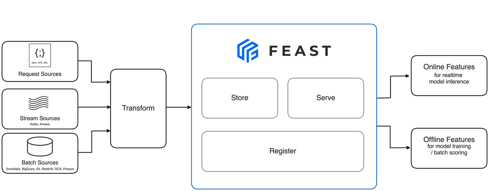

# Feast

Feast is an open source feature store that delivers structured data to AI and LLM applications at high scale during training and inference

## Architecture & Components

### Feature Server

The Feature Server is a core architectural component in Feast, designed to provide low-latency feature retrieval and updates for machine learning applications. It is a REST API server built using [FastAPI](https://fastapi.tiangolo.com/) and exposes a limited set of endpoints to serve features, push data, and support materialization operations.

The Feature Server operates as a stateless service backed by two key components:

- **[Online Store](https://docs.feast.dev/getting-started/components/online-store):** The primary data store used for low-latency feature retrieval.
- **[Registry](https://docs.feast.dev/getting-started/components/registry):** The metadata store that defines feature sets, feature views, and their relationships to entities.

Key Features of Feature Server

- RESTful API: Provides standardized endpoints for feature retrieval and data pushing.
- CLI Integration: Easily managed through the Feast CLI with commands like feast serve.
- Flexible Deployment: Can be deployed locally, via Docker, or on Kubernetes using Helm charts.
- Scalability: Designed for distributed deployments to handle large-scale workloads.
- TLS Support: Ensures secure communication in production setups.

---

- [Feast](https://feast.dev/)
- [Feature Server | Feast](https://docs.feast.dev/getting-started/components/feature-server)
