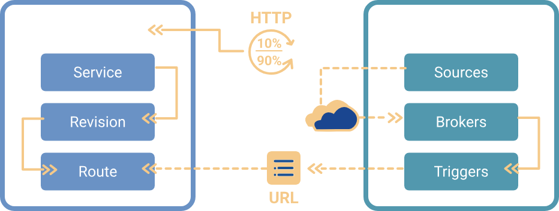

# Knative Introduction

- Knative is an Open-Source Enterprise-level solution to build Serverless and Event Driven Applications
- Why serverless containers?
    - Simpler Abstractions
    - Autoscaling (Scale down to zero and up from zero)
    - Progressive Rollouts
    - Event Integrations
    - Handle Events
    - Plugable

## Knative 適合使用的情境

- 事件觸發型應用（Event-Driven Applications）當應用程式只需要在特定事件發生時執行，例如：
    - GitHub webhook: 有 push 事件時觸發自動部署流程
    - Kafka message: 有訊息進入特定 topic 時啟動處理邏輯
    - IoT 資料上傳: 設備回傳資料就處理一次
    - 定時工作: 每10分鐘執行一次資料清洗任務
- 不需要一直運行的應用 (Scale-to-zero)
    - 開發環境 API: 不常被調用，但不能下線  
    - 自助報表產生: 使用者點選時才啟動產生程式  
    - 使用者觸發的任務: 例如資料導入、轉換等臨時任務  
- 藍綠部署與灰階發布 (Blue-Green / Canary Release)
    - 發布新版本: 可將 10% 流量導向新版本  
    - 逐步擴大流量: 根據健康狀況慢慢轉移流量  
    - 快速回退: 新版有問題時立即切回舊版  
- 無伺服器函數 (FaaS) 平台建設
    - 建立企業內部 FaaS: 開發者只需提供 container 映像即可  
    - 自定義觸發條件: 可綁定 Kafka、Webhook、Cron 等  
    - 標準化事件格式: 支援 CloudEvents 標準格式  
- 結合 DevOps / GitOps 的快速交付場景
    - 自動部署 pipeline: Git push --> Tekton build --> Knative deploy  
    - GitOps Workflow: Git 設定變更 --> 自動更新 revision  
    - 多版本控管與切換: 可快速切換版本、測試、回退  
- 資源敏感型的微服務架構
    - 使用者報表服務: 白天用量高、晚上幾乎沒人用  
    - 行銷活動系統: 活動期間高峰，平常無人使用  
    - Edge/IoT 節點: 需節省 CPU/Memory 使用量  

## 不適合 Knative 的場景

- 高吞吐、低延遲常駐服務: scale-to-zero 會造成冷啟動延遲
- WebSocket / gRPC Streaming: 不支援長連線協定
- 非 HTTP 協議: Knative Serving 目前只支援 HTTP-based 請求
- 有狀態服務: Knative 僅支援 stateless container

## Knative History

- Knative 最初由 Google 於 2018 年 7 月發起，並與 IBM、Red Hat、VMware 和 SAP 等公司密切合作開發。
- 發展里程碑
    - 2018 年 7 月：Knative 首次公開發布。
    - 2019 年 3 月：Build 組件演進為 Tekton，專注於 CI/CD。
    - 2019 年 9 月：Serving API 達到 v1 版本。
    - 2020 年 7 月：Eventing API 達到 v1 版本。
    - 2021 年 11 月：Knative 發布 1.0 版本，標誌著其穩定性和商業可用性。
    - 2022 年 3 月：Knative 成為 CNCF 的孵化專案。

## Knative Seving & Eventing

- Knative has two main components that empower teams working with Kubernetes. **Serving** and **Eventing** work together to automate and manage tasks and applications.
- serving and eventing各自獨立，可分別安裝使用
- Knative Serving: Run serverless containers in Kubernetes with ease. Knative takes care of the details of networking, autoscaling (even to zero), and revision tracking. Teams can focus on core logic using any programming language.
- Knative Eventing: Universal subscription, delivery and management of events. Build modern apps by attaching compute to a data stream with declarative event connectivity and developer friendly object models.

### Knative Eventing

Knative Eventing is a powerful Kubernetes-based framework that enables event-driven application development. It allows developers to build loosely coupled, reactive services that respond to events from various sources. By decoupling producers and consumers of events, Knative Eventing makes it easier to scale, update, and maintain modern cloud-native applications, especially in serverless environments.

The core components of Knative Eventing include **Event Sources**, **Brokers**, and **Triggers**. **Event sources** can originate from systems like GitHub (webhooks), Apache Kafka, CronJobs, Kubernetes API server events, or even custom containers that emit CloudEvents. A **Broker** acts as a central event mesh that receives and buffers incoming events. **Triggers** are routing rules that filter events from the Broker and forward them to services based on specific criteria. Currently, the most common event delivery mechanism is **HTTP** using the **CloudEvents** specification, typically in a **push-based manner** to HTTP endpoints such as Knative Services.

For example, imagine you’ve deployed Knative Eventing with a PingSource that emits an event every minute. This event is sent to a Broker, which acts as an event hub. A Trigger listens on that Broker and filters events based on attributes like the event type. When a matching event arrives, the Trigger forwards it to a Knative Service (a containerized HTTP handler). Behind the scenes, Knative handles service discovery, traffic routing, autoscaling (even from zero), and ensures that the container is activated just-in-time to handle the event. This creates a seamless, scalable, and efficient event-driven pipeline without needing to manage infrastructure manually.