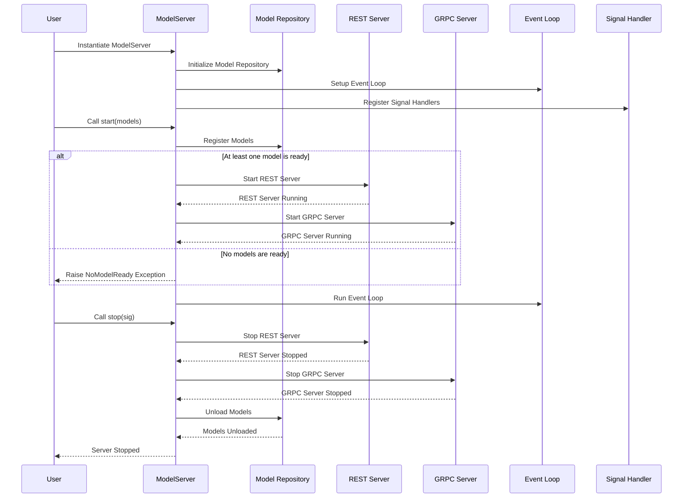

# Write a Custom KServe Transformer with Feast Integration

This guide demonstrates how to integrate Feast with KServe, enabling feature retrieval and transformation during inference.

## Extend the KServe Model Class

`KServe.Model` base class mainly defines three handlers `preprocess`, `predict` and `postprocess`, these handlers are executed in sequence where the output of the `preprocess` handler is passed to the `predict` handler as the input.

To create a custom transformer that retrieves features from Feast, you will extend the `KServe.Model` class and implement the `preprocess` method. This method will dynamically fetch features based on the input data and append them to the inference request.

```py title="feast_transformer.py"
--8<-- "./data2ml-ops/kserve/docker/feast_transformer/feast_transformer.py:class"
```

### Logic of the `preprocess()` Method

The `preprocess()` method plays a pivotal role in the inference pipeline by preparing the input data for prediction. It begins by parsing the payload to extract entity IDs (`extract_entity_ids()`), which are essential for querying the Feast feature store.

Once the entity IDs are identified, the method sends a request to the Feast online feature server to fetch the corresponding features. 

Finally, it processes the response from Feast, transforming the retrieved features into a format that aligns with the requirements of the predictor (`create_inference_request`). This ensures a seamless flow of data, enabling accurate and efficient predictions.

Since the transformer is designed to handle multiple protocols, the `preprocess()` method checks the request type and processes it accordingly. It supports REST v1, REST v2, and gRPC protocols, ensuring compatibility with various KServe deployments. Additionally, the method processes the response received from Feast based on the protocol used by the predictor. By tailoring both the incoming request handling and the outgoing response formatting, this Feast transformer becomes a highly versatile and adaptable component within the KServe ecosystem.


```py title="feast_transformer.py" hl_lines="1 18 20-30 41" linenums="1"
--8<-- "./data2ml-ops/kserve/docker/feast_transformer/feast_transformer.py:preprocess"
```

```py title="feast_transformer.py" hl_lines="1 18 27" linenums="1"
--8<-- "./data2ml-ops/kserve/docker/feast_transformer/feast_transformer.py:extract_entity_ids"
```

```py title="feast_transformer.py" hl_lines="1 16 26" linenums="1"
--8<-- "./data2ml-ops/kserve/docker/feast_transformer/feast_transformer.py:create_inference_request"
```

## Package the Custom Transformer

Packaging the custom transformer is essential to ensure it can be easily deployed and reused across different environments. By organizing the code into a well-defined structure and containerizing it, we create a portable and self-contained solution that can be seamlessly integrated into any KServe deployment. This approach not only simplifies dependency management but also ensures consistency and reliability, making it easier to scale and maintain the transformer in production.

First, create a directory structure for your custom transformer:

```
.
├── __init__.py
├── __main__.py
└── feast_transformer.py
```

Then, extend the `__main__.py` file to include custom arguments that allow us to easily inject Feast-related information into the KServe transformer. This makes it convenient to specify details like the Feast URL, entity ID, and feature service directly in the inference service YAML file. By doing so, we ensure that the transformer remains flexible and configurable, adapting seamlessly to different deployment environments.

```py title="__main__.py" 
--8<-- "./data2ml-ops/kserve/docker/feast_transformer/__main__.py:parser"
```

When you run the transformer, you can specify the Feast URL, entity ID, and feature service as command-line arguments. This allows the transformer to dynamically connect to the Feast feature store and retrieve the necessary features for inference.

```bash
python -m feast_transformer \
  --feast_url http://example.com:6565 \
  --feast_entity_id entity_id \
  --feature-service fraud_detection_v1
```

After the arguments are parsed, the `main()` function initializes the KServe model with the provided Feast configuration and starts the model server.

```py title="__main__.py" hl_lines="13" linenums="1"
--8<-- "./data2ml-ops/kserve/docker/feast_transformer/__main__.py:main"
```

Here's a sequence diagram when we start the KServe Model Server:



## Containerize the Transformer

```
kserve/docker
├── README.md
├── pyproject.toml
├── uv.lock
├── Dockerfile
├── .dockerignore
├── feast_transformer
│   ├── __init__.py
│   ├── __main__.py
└   └── feast_transformer.py
```

First, create a `pyproject.toml` file to define the dependencies for your custom transformer. This file will be used by the `uv` package manager to install the necessary libraries.


```toml title="pyproject.toml" 
--8<-- "./data2ml-ops/kserve/docker/pyproject.toml"
```

Next, use the `uv` package manager to install the dependencies and generate a lock file. The lock file ensures that the same versions of the dependencies are used across different environments, providing consistency and reliability.

```bash
uv lock
```

Then, create a `Dockerfile` to build the custom transformer image. This Dockerfile uses a multi-stage build process to ensure that the final image is lightweight and contains only the necessary components.

```dockerfile title="Dockerfile"
--8<-- "./data2ml-ops/kserve/docker/Dockerfile"
```

The first stage (`builder`) uses the `uv` package manager to install all dependencies defined in the `pyproject.toml` file. It also caches dependencies to speed up subsequent builds and compiles Python bytecode for better performance. Additionally, it installs build tools like `gcc` and `python3-dev` to handle dependencies requiring compilation, such as `psutil`.

The `uv sync` command is run twice in this stage. The first `uv sync` installs only the dependencies without the project files, ensuring that the dependency installation is cached and reused across builds. The second `uv sync` installs the project files and finalizes the environment. **This two-step process minimizes rebuild times** by leveraging cached dependencies while still ensuring the application code is up-to-date.

The second stage creates the final image. It copies the application and its dependencies from the `builder` stage into a minimal Python base image. This ensures the final image is small and optimized for production use. The `PATH` environment variable is updated to include the virtual environment created by `uv`, and the entry point is set to run the transformer using the `python -m feast_transformer` command.

This approach ensures a clean, efficient, and portable container image for deploying the Feast transformer.

Finally, build the Docker image and load it into Minikube. This step is crucial for deploying the transformer in a local Kubernetes environment, allowing you to test and validate the integration with KServe and Feast.

```bash
docker buildx build \
  --platform linux/amd64 \
  -t feast-transformer:v0.1.0 \
  .
```


```bash
minikube image load feast-transformer:v0.1.0
```