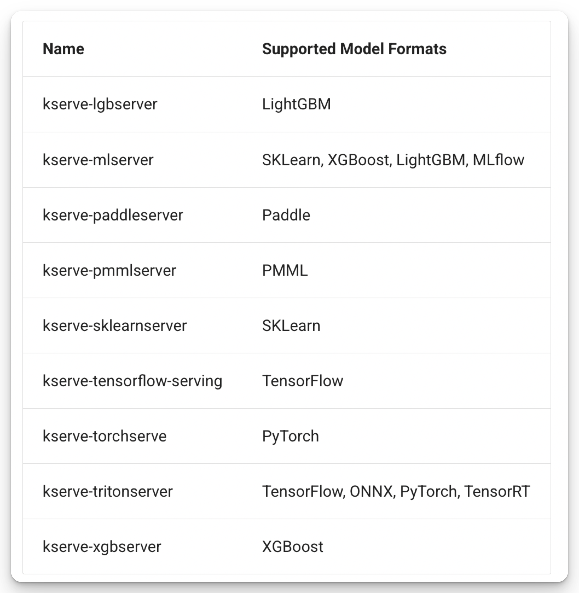
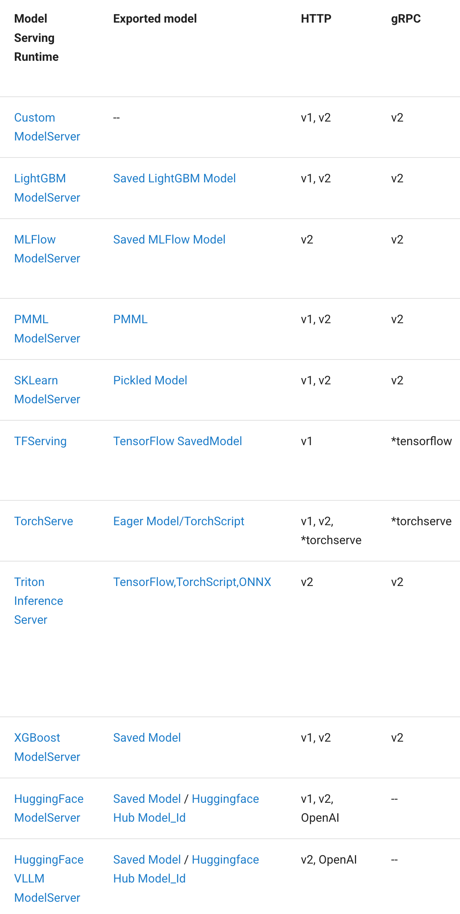

# How It Works?

KServe can be installed in two modes:

1. **Serverless Mode (Recommended)**: Powered by Knative and Istio, this mode offers benefits such as automatic scaling, enhanced security, simplified traffic management, and seamless integration with serverless workflows.[^1]
2. **RawDeployment Mode**: Utilizes native Kubernetes resources like Deployment, Service, Ingress, and Horizontal Pod Autoscaler, providing a more traditional approach to model serving.[^2]

<figure markdown="span">
  {width="500"}
  *KServe Architecture on Serverless Mode*[^3]
</figure>


## Architecture Components 

### Control Plane

*KServe Controller*

: Handles the creation of services, ingress resources, model server containers, and model agent containers to facilitate request/response logging, batching, and model retrieval.[^4]

*Ingress Gateway*

: Acts as an entry point for directing external or internal traffic to the appropriate services.[^4]

If operating in Serverless mode, the following additional components are included:

*Knative Serving Controller*

: Manages service revisions, sets up network routing configurations, and provisions serverless containers with a queue proxy to handle traffic metrics and enforce concurrency limits.[^4]

*Knative Activator*

: Responsible for reviving pods that have been scaled down to zero and routing incoming requests to them.[^4]

*Knative Autoscaler (KPA)*

: Monitors application traffic and dynamically adjusts the number of replicas based on predefined metrics.[^4]

### Data Plane

*InferenceService*

: An InferenceService in KServe is a Kubernetes custom resource designed to simplify the deployment and management of machine learning models for inference. It integrates components such as **predictors**, **transformers**, and **explainers**, offering capabilities like autoscaling, version control, and traffic splitting to optimize model serving in production.[^5]

*Predictor*

: The predictor is the core component of the InferenceService, responsible for hosting the model and exposing it through a network endpoint for inference requests.[^5]

*Explainer*

: The explainer provides an optional feature that generates model explanations alongside predictions, offering insights into the model's decision-making process.[^5]

*Transformer*

: The transformer allows users to define custom pre-processing and post-processing steps, enabling data transformations before predictions or explanations are generated.[^5]

### Serving Runtimes

KServe utilizes two types of Custom Resource Definitions (CRDs) to define model serving environments: `ServingRuntimes` and `ClusterServingRuntimes`. The primary distinction between them is their scope—`ServingRuntimes` are namespace-scoped, while `ClusterServingRuntimes` are cluster-scoped.

*ServingRuntime / ClusterServingRuntime*

: These CRDs specify templates for Pods capable of serving one or more specific model formats. Each ServingRuntime includes essential details such as the runtime's container image and the list of supported model formats[^8].

KServe provides several pre-configured *ClusterServingRuntimes*, enabling users to deploy popular model formats without the need to manually define the runtimes.

<figure markdown="span">
  {width="400"}
  *Support Model Formats*[^8][^9]
</figure>

## Core Concepts

### Inference Service

The following example demonstrates the minimum setup required to deploy an InferenceService in KServe[^10]:

```yaml linenums="1" hl_lines="6-10"
apiVersion: "serving.kserve.io/v1beta1"
kind: "InferenceService"
metadata:
  name: "sklearn-iris"
spec:
  predictor:
    model:
      modelFormat:
        name: sklearn
      storageUri: "gs://kfserving-examples/models/sklearn/1.0/model"
```

Predictor:

- **Model Format**: Specifies the framework or format of the model being served. In this example, the model format is `sklearn`.
- **Storage URI**: Indicates the location of the model file. Here, the model is stored in a Google Cloud Storage bucket at `gs://kfserving-examples/models/sklearn/1.0/model`.

To ensure that the pod can successfully load the model, proper permissions must be configured.[^16][^17]

Once applied, your InferenceService will be successfully deployed:

```bash
kubectl get inferenceservices sklearn-iris -n kserve-test
```

```bash
NAME           URL                                                 READY   PREV   LATEST   PREVROLLEDOUTREVISION   LATESTREADYREVISION                    AGE
sklearn-iris   http://sklearn-iris.kserve-test.example.com         True           100                              sklearn-iris-predictor-default-47q2g   7d23h
```

### Inference Protocol

KServe's data plane protocol provides a framework-agnostic **inference API** that works seamlessly across various ML/DL frameworks and model servers. It supports two versions:

- **v1**: Offers support exclusively for REST APIs.[^6]
- **v2**: Extends support to both REST and gRPC APIs.[^7]

To use v2 REST protocol for inference with the deployed model, you set the `protocolVersion` field to v2[^11]:

```yaml linenums="1" hl_lines="10"
apiVersion: "serving.kserve.io/v1beta1"
kind: "InferenceService"
metadata:
  name: "mlflow-v2-wine-classifier"
spec:
  predictor:
    model:
      modelFormat:
        name: mlflow
      protocolVersion: v2
      storageUri: "gs://kfserving-examples/models/mlflow/wine"
```

Not all server runtimes support v2 inference protocol and gRPC protocol, you should check [here](https://kserve.github.io/website/latest/modelserving/v1beta1/serving_runtime/)[^9] for more information.

<figure markdown="span">
{width="400"}
*Supported Protocols for Each Server Runtime*[^9]
</figure>

To use v2 gRPC protocol for inference with the deployed model, you set the container port to be `8081` and the name of port to be `h2c`[^12](this setup is not for TensorFlow and PyTorch, which have their own settings).

```yaml linenums="1" hl_lines="13-16"
apiVersion: "serving.kserve.io/v1beta1"
kind: "InferenceService"
metadata:
  name: "sklearn-v2-iris-grpc"
spec:
  predictor:
    model:
      modelFormat:
        name: sklearn
      protocolVersion: v2
      runtime: kserve-sklearnserver
      storageUri: "gs://kfserving-examples/models/sklearn/1.0/model"
      ports:
        - name: h2c     # knative expects grpc port name to be 'h2c'
          protocol: TCP
          containerPort: 8081

```

### Autoscaling

Set up based on what condition to scale up the predictor using `scaleTarget` and  `scaleMetric`.[^18]

```yaml linenums="1" hl_lines="7 8"
apiVersion: "serving.kserve.io/v1beta1"
kind: "InferenceService"
metadata:
  name: "flowers-sample"
spec:
  predictor:
    scaleTarget: 1
    scaleMetric: concurrency # "qps" is an option as well
    model:
      modelFormat:
        name: tensorflow
      storageUri: "gs://kfserving-examples/models/tensorflow/flowers"
```

Scale to zero using `minReplicas: 0`.[^18]

```yaml linenums="1" hl_lines="7"
apiVersion: "serving.kserve.io/v1beta1"
kind: "InferenceService"
metadata:
  name: "flowers-sample"
spec:
  predictor:
    minReplicas: 0
    model:
      modelFormat:
        name: tensorflow
      storageUri: "gs://kfserving-examples/models/tensorflow/flowers"
```


### Canary Rollout

KServe supports **canary rollout**, a deployment strategy that allows you to gradually shift traffic between different versions of a model. This approach minimizes risks by enabling you to test new versions (canary models) with a small percentage of traffic before fully rolling them out.

Promote the canary model or roll back to the previous model using the `canaryTrafficPercent` field. In addition, you can use the `serving.kserve.io/enable-tag-routing` annotation to route traffic explicitly. This allows you to direct traffic to the canary model (model v2) or the previous model (model v1) by including a tag in the request URL.[^13]


### Inference Graph

Modern ML inference systems are increasingly complex, often requiring multiple models to generate a single prediction. KServe simplifies this process by supporting `InferenceGraph`, allowing users to define and deploy intricate ML inference pipelines in a declarative and scalable manner for production use.[^14]

<figure markdown="span">

*Inference Graph*[^14]
</figure>

*InferenceGraph*

: Composed of routing `Nodes`, each containing a series of routing `Steps`. Each `Step` can direct traffic to either an InferenceService or another `Node` within the graph, making the `InferenceGraph` highly modular. The `InferenceGraph` supports four types of Routing `Nodes`: Sequence, Switch, Ensemble, and Splitter.[^14]

*Sequence Node*

: Enables users to define a series of `Steps` where each `Step` routes to an `InferenceService` or another `Node` in a sequential manner. The output of one `Step` can be configured to serve as the input for the next `Step`.[^14]

*Ensemble Node*

: Facilitates model ensembles by running multiple models independently and combining their outputs into a single prediction. Various methods, such as majority voting for classification or averaging for regression, can be used to aggregate the results.[^14]

*Splitter Node*

: Distributes traffic across multiple targets based on a specified weighted distribution.[^14]

*Switch Node*

: Allows users to specify **routing conditions** to determine which `Step` to execute. The response is returned as soon as a condition is met. If no conditions are satisfied, the graph returns the original request.[^14]

Example[^15]

```yaml linenums="1" hl_lines="2 6-15" 
apiVersion: "serving.kserve.io/v1alpha1"
kind: "InferenceGraph"
metadata:
  name: "dog-breed-pipeline"
spec:
  nodes:
    root:
      routerType: Sequence
      steps:
      - serviceName: cat-dog-classifier
        name: cat_dog_classifier # step name
      - serviceName: dog-breed-classifier
        name: dog_breed_classifier
        data: $request
        condition: "[@this].#(predictions.0==\"dog\")"
  resources:
    requests:
      cpu: 100m
      memory: 256Mi
    limits:
      cpu: 1
      memory: 1Gi
```

## Behind the Scenes


When you apply an `InferenceService` using `kubectl apply`, the following steps occur behind the scenes (in serverless mode):

1. The **KServe Controller** receives the request and deploys a Knative Service.
2. A **Knative Revision** is prepared to manage versioning and traffic routing.
3. The **Transformer** and **Predictor Pods** are deployed, with autoscaling configurations set up via the **Knative Autoscaler**.
4. The **Predictor Pod** uses an **InitContainer (Storage Initializer)** to fetch the model from a storage location (e.g., GCS, S3).
5. Once the model is retrieved, the **Predictor Pod** deploys the model using the specified **Server Runtime**.
6. The **Predictor Pod** exposes its endpoint through a **Queue Proxy**, which handles traffic metrics and concurrency limits. The endpoint is then made accessible externally via a **Service**.
7. The **Transformer Pod**, which handles pre-processing and post-processing logic, does not require a storage initializer. It simply deploys the transformer container.
8. Similar to the Predictor Pod, the Transformer Pod exposes its endpoint through a **Queue Proxy**, making it accessible externally via a **Service**.
9. Finally, the backend of your AI application can call the `InferenceService` endpoints to execute pre-processing, prediction, and post-processing. The system dynamically scales up or down based on the configured autoscaling metrics.

This seamless orchestration ensures efficient and scalable model serving for your AI applications.

[^1]: [Serverless Installation Guide](https://kserve.github.io/website/latest/admin/serverless/serverless/)
[^2]: [Kubernetes Deployment Installation Guide](https://kserve.github.io/website/latest/admin/kubernetes_deployment/)
[^3]: [KServe Docs](https://kserve.github.io/website/latest/)
[^4]: [Control Plane](https://kserve.github.io/website/latest/modelserving/control_plane/)
[^5]: [Data Plane](https://kserve.github.io/website/latest/modelserving/data_plane/data_plane/)
[^6]: [V1 Inference Protocol](https://kserve.github.io/website/latest/modelserving/data_plane/v1_protocol/)
[^7]: [V2 Inference Protocol](https://kserve.github.io/website/latest/modelserving/data_plane/v2_protocol/)
[^8]: [Serving Runtimes | Concepts](https://kserve.github.io/website/latest/modelserving/servingruntimes/)
[^9]: [Model Serving Runtimes | Supported Model Frameworks/Formats](https://kserve.github.io/website/latest/modelserving/v1beta1/serving_runtime/)
[^10]: [First InferenceService](https://kserve.github.io/website/latest/get_started/first_isvc/#2-create-an-inferenceservice)
[^11]: [Deploy MLflow models with InferenceService¶](https://kserve.github.io/website/latest/modelserving/v1beta1/mlflow/v2/)
[^12]: [Deploy Scikit-learn models with InferenceService](https://kserve.github.io/website/latest/modelserving/v1beta1/sklearn/v2/#deploy-the-model-with-grpc-endpoint-through-inferenceservice)
[^13]: [Canary Rollout Example](https://kserve.github.io/website/latest/modelserving/v1beta1/rollout/canary-example/)
[^14]: [Inference Graph](https://kserve.github.io/website/latest/modelserving/inference_graph/)
[^15]: [Deploy Image Processing Inference pipeline with InferenceGraph](https://kserve.github.io/website/latest/modelserving/inference_graph/image_pipeline/#deploy-inferencegraph)
[^16]: [Deploy InferenceService with a saved model on S3](https://kserve.github.io/website/latest/modelserving/storage/s3/s3/)
[^17]: [Deploy InferenceService with a saved model on GCS](https://kserve.github.io/website/latest/modelserving/storage/gcs/gcs/)
[^18]: [Autoscale InferenceService with Knative Autoscaler](https://kserve.github.io/website/latest/modelserving/autoscaling/autoscaling/)
