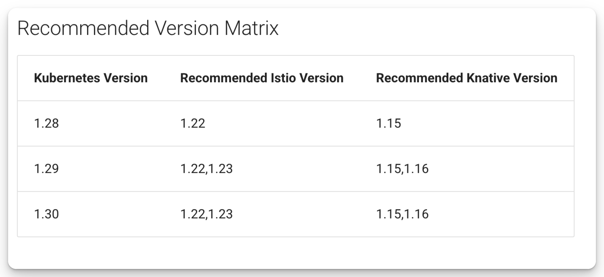

# Install Kserve in Serverless Mode

To install KServe in serverless mode, you need to first install three components: Knative Serving, Networking Layer, and Cert Manager.

KServe provides a recommended version matrix for Knative Serving and Istio based on your Kubernetes version.

<figure markdown="span">
    {width="500"}
    *Recommended Version Matrix*[^1]
</figure>

Since my Kubernetes version is 1.30, I will install the following versions:

- Knative Serving v1.15.0
- Istio v1.22.8
- Cert Manager v1.17.2
- KServe v0.15.1

## Install Knative Serving[^2]
<!-- TODO -->
Before install, nothing

```bash
kubectl get ns
```

!!! note "Expected Output"

    ```
    NAME              STATUS   AGE
    default           Active   15d
    kube-node-lease   Active   15d
    kube-public       Active   15d
    kube-system       Active   15d
    ```

Install the required custom resources by running the command:

```bash
kubectl apply -f https://github.com/knative/serving/releases/download/{==knative-v1.15.0/serving-crds.yaml==}
```

??? note "Expected Output"

    ```
    customresourcedefinition.apiextensions.k8s.io/certificates.networking.internal.knative.dev created
    customresourcedefinition.apiextensions.k8s.io/configurations.serving.knative.dev created
    customresourcedefinition.apiextensions.k8s.io/clusterdomainclaims.networking.internal.knative.dev created
    customresourcedefinition.apiextensions.k8s.io/domainmappings.serving.knative.dev created
    customresourcedefinition.apiextensions.k8s.io/ingresses.networking.internal.knative.dev created
    customresourcedefinition.apiextensions.k8s.io/metrics.autoscaling.internal.knative.dev created
    customresourcedefinition.apiextensions.k8s.io/podautoscalers.autoscaling.internal.knative.dev created
    customresourcedefinition.apiextensions.k8s.io/revisions.serving.knative.dev created
    customresourcedefinition.apiextensions.k8s.io/routes.serving.knative.dev created
    customresourcedefinition.apiextensions.k8s.io/serverlessservices.networking.internal.knative.dev created
    customresourcedefinition.apiextensions.k8s.io/services.serving.knative.dev created
    customresourcedefinition.apiextensions.k8s.io/images.caching.internal.knative.dev created
    ```

Deploy the core components of Knative Serving to you Kubernetes cluster (namespace `knative-serving`) by running the command:

```bash
kubectl apply -f https://github.com/knative/serving/releases/download/{==knative-v1.15.0/serving-core.yaml==}
```

??? note "Expected Output"

    ```
    {==namespace/knative-serving created==}
    role.rbac.authorization.k8s.io/knative-serving-activator created
    clusterrole.rbac.authorization.k8s.io/knative-serving-activator-cluster created
    clusterrole.rbac.authorization.k8s.io/knative-serving-aggregated-addressable-resolver created
    clusterrole.rbac.authorization.k8s.io/knative-serving-addressable-resolver created
    clusterrole.rbac.authorization.k8s.io/knative-serving-namespaced-admin created
    clusterrole.rbac.authorization.k8s.io/knative-serving-namespaced-edit created
    clusterrole.rbac.authorization.k8s.io/knative-serving-namespaced-view created
    clusterrole.rbac.authorization.k8s.io/knative-serving-core created
    clusterrole.rbac.authorization.k8s.io/knative-serving-podspecable-binding created
    serviceaccount/controller created
    clusterrole.rbac.authorization.k8s.io/knative-serving-admin created
    clusterrolebinding.rbac.authorization.k8s.io/knative-serving-controller-admin created
    clusterrolebinding.rbac.authorization.k8s.io/knative-serving-controller-addressable-resolver created
    serviceaccount/activator created
    rolebinding.rbac.authorization.k8s.io/knative-serving-activator created
    clusterrolebinding.rbac.authorization.k8s.io/knative-serving-activator-cluster created
    customresourcedefinition.apiextensions.k8s.io/images.caching.internal.knative.dev unchanged
    certificate.networking.internal.knative.dev/routing-serving-certs created
    customresourcedefinition.apiextensions.k8s.io/certificates.networking.internal.knative.dev unchanged
    customresourcedefinition.apiextensions.k8s.io/configurations.serving.knative.dev unchanged
    customresourcedefinition.apiextensions.k8s.io/clusterdomainclaims.networking.internal.knative.dev unchanged
    customresourcedefinition.apiextensions.k8s.io/domainmappings.serving.knative.dev unchanged
    customresourcedefinition.apiextensions.k8s.io/ingresses.networking.internal.knative.dev unchanged
    customresourcedefinition.apiextensions.k8s.io/metrics.autoscaling.internal.knative.dev unchanged
    customresourcedefinition.apiextensions.k8s.io/podautoscalers.autoscaling.internal.knative.dev unchanged
    customresourcedefinition.apiextensions.k8s.io/revisions.serving.knative.dev unchanged
    customresourcedefinition.apiextensions.k8s.io/routes.serving.knative.dev unchanged
    customresourcedefinition.apiextensions.k8s.io/serverlessservices.networking.internal.knative.dev unchanged
    customresourcedefinition.apiextensions.k8s.io/services.serving.knative.dev unchanged
    image.caching.internal.knative.dev/queue-proxy created
    configmap/config-autoscaler created
    configmap/config-certmanager created
    configmap/config-defaults created
    configmap/config-deployment created
    configmap/config-domain created
    configmap/config-features created
    configmap/config-gc created
    configmap/config-leader-election created
    configmap/config-logging created
    configmap/config-network created
    configmap/config-observability created
    configmap/config-tracing created
    {==horizontalpodautoscaler.autoscaling/activator==} created
    poddisruptionbudget.policy/activator-pdb created
    deployment.apps/{==activator==} created
    service/activator-service created
    deployment.apps/{==autoscaler==} created
    service/autoscaler created
    deployment.apps/{==controller==} created
    service/controller created
    {==horizontalpodautoscaler.autoscaling/webhook==} created
    poddisruptionbudget.policy/webhook-pdb created
    deployment.apps/{==webhook==} created
    service/webhook created
    validatingwebhookconfiguration.admissionregistration.k8s.io/config.webhook.serving.knative.dev created
    mutatingwebhookconfiguration.admissionregistration.k8s.io/webhook.serving.knative.dev created
    validatingwebhookconfiguration.admissionregistration.k8s.io/validation.webhook.serving.knative.dev created
    secret/webhook-certs created
    ```

<!-- TODO -->
Once the deployment finished, you can see `knative-serving` namespace created and all the resources inside:

```bash
kubectl get ns
```

!!! note "Expected Output"
    ```
    NAME              STATUS   AGE
    default           Active   15d
    {==knative-serving   Active   17s==}
    kube-node-lease   Active   15d
    kube-public       Active   15d
    kube-system       Active   15d
    ```

```bash
kubectl get all -n knative-serving
```

!!! note "Expected Output"

    ```
    kubectl get all -n knative-serving
    NAME                              READY   STATUS    RESTARTS   AGE
    pod/{==activator==}-bccd57594-l5n5m     1/1     Running   0          3m16s
    pod/{==autoscaler==}-7c6d8b8456-lwn6b   1/1     Running   0          3m16s
    pod/{==controller==}-6458dc4845-bv7st   1/1     Running   0          3m16s
    pod/{==webhook==}-68b5b4c69-8jv7q       1/1     Running   0          3m16s

    NAME                                 TYPE        CLUSTER-IP       EXTERNAL-IP   PORT(S)                                   AGE
    service/activator-service            ClusterIP   10.110.50.161    <none>        9090/TCP,8008/TCP,80/TCP,81/TCP,443/TCP   3m16s
    service/autoscaler                   ClusterIP   10.105.23.244    <none>        9090/TCP,8008/TCP,8080/TCP                3m16s
    service/autoscaler-bucket-00-of-01   ClusterIP   10.108.159.205   <none>        8080/TCP                                  2m55s
    service/controller                   ClusterIP   10.110.203.67    <none>        9090/TCP,8008/TCP                         3m16s
    service/webhook                      ClusterIP   10.104.187.107   <none>        9090/TCP,8008/TCP,443/TCP                 3m16s

    NAME                         READY   UP-TO-DATE   AVAILABLE   AGE
    deployment.apps/{==activator==}    1/1     1            1           3m16s
    deployment.apps/{==autoscaler==}   1/1     1            1           3m16s
    deployment.apps/{==controller==}   1/1     1            1           3m16s
    deployment.apps/{==webhook==}      1/1     1            1           3m16s

    NAME                                    DESIRED   CURRENT   READY   AGE
    replicaset.apps/activator-bccd57594     1         1         1       3m16s
    replicaset.apps/autoscaler-7c6d8b8456   1         1         1       3m16s
    replicaset.apps/controller-6458dc4845   1         1         1       3m16s
    replicaset.apps/webhook-68b5b4c69       1         1         1       3m16s

    NAME                                            REFERENCE              TARGETS               MINPODS   MAXPODS   REPLICAS   AGE
    horizontalpodautoscaler.autoscaling/activator   Deployment/activator   cpu: <unknown>/100%   1         20        1          3m16s
    horizontalpodautoscaler.autoscaling/webhook     Deployment/webhook     cpu: <unknown>/100%   1         5         1          3m16s
    ```

<!-- TODO -->
部署完成後，可以看到有以下這四個pods，分別負責

- activator
- autoscaler
- controller
- webhook

## Install Networking Layer - Istio[^3]

Install Istio 1.22.8 on the home directory

```
cd $HOME
curl -L https://istio.io/downloadIstio | ISTIO_VERSION={==1.22.8==} sh -
```

??? note "Expected Output"

    ```
    % Total    % Received % Xferd  Average Speed   Time    Time     Time  Current
                                    Dload  Upload   Total   Spent    Left  Speed
    100   102  100   102    0     0    350      0 --:--:-- --:--:-- --:--:--   351
    100  5124  100  5124    0     0   6834      0 --:--:-- --:--:-- --:--:-- 13343

    Downloading istio-1.22.8 from https://github.com/istio/istio/releases/download/1.22.8/istio-1.22.8-osx-arm64.tar.gz ...

    Istio 1.22.8 download complete!

    The Istio release archive has been downloaded to the istio-1.22.8 directory.

    To configure the istioctl client tool for your workstation,
    add the /Users/kcl/istio-1.22.8/bin directory to your environment path variable with:
        {==export PATH="$PATH:/Users/kcl/istio-1.22.8/bin"==}

    Begin the Istio pre-installation check by running:
        istioctl x precheck 

    Try Istio in ambient mode
        https://istio.io/latest/docs/ambient/getting-started/
    Try Istio in sidecar mode
        https://istio.io/latest/docs/setup/getting-started/
    Install guides for ambient mode
        https://istio.io/latest/docs/ambient/install/
    Install guides for sidecar mode
        https://istio.io/latest/docs/setup/install/

    Need more information? Visit https://istio.io/latest/docs/
    ```

<!-- TODO -->
Add the `$HOME/istio-1.22.8/bin` directory to your environment path variable

```sh
export PATH="$PATH:$HOME/istio-1.22.8/bin"
```

Check the versions

```bash
istioctl version
```

!!! note "Expected Output"

    ```
    client version: 1.22.8
    control plane version: 1.22.8
    data plane version: 1.22.8 (1 proxies)
    ```


You can easily install and customize your Istio installation with `istioctl`. It will deploy the resources to your kubernetes cluster in the namespace `istio-system`

```
istioctl install -y
```

!!! note "Expected Output"

    ```
    WARNING: Istio 1.22.0 may be out of support (EOL) already: see https://istio.io/latest/docs/releases/supported-releases/ for supported releases
    ✔ {==Istio==} core installed                       
    ✔ {==Istiod==} installed                           
    ✔ {==Ingress==} gateways installed
    ✔ Installation complete
    Made this installation the default for injection and validation.
    ```


Check all the deployed resources

```bash
kubectl get ns
```

!!! note "Expected Output"

    ```
    NAME              STATUS   AGE
    default           Active   15d
    {==istio-system==}      Active   62s
    knative-serving   Active   18m
    kube-node-lease   Active   15d
    kube-public       Active   15d
    kube-system       Active   15d
    ```

```bash
kubectl get all -n istio-system
```

!!! note "Expected Output"

    ```
    NAME                                        READY   STATUS    RESTARTS   AGE
    pod/{==istio-ingressgateway==}-767ff7b4b6-7wxzk   1/1     Running   0          5m52s
    pod/{==istiod==}-7bc77d764b-vh66z                 1/1     Running   0          6m18s

    NAME                           TYPE           CLUSTER-IP      EXTERNAL-IP   PORT(S)                                      AGE
    service/istio-ingressgateway   LoadBalancer   10.97.252.211   {==<pending>==}     15021:32213/TCP,80:31540/TCP,443:30462/TCP   5m52s
    service/istiod                 ClusterIP      10.96.206.177   <none>        15010/TCP,15012/TCP,443/TCP,15014/TCP        6m18s

    NAME                                   READY   UP-TO-DATE   AVAILABLE   AGE
    deployment.apps/{==istio-ingressgateway==}   1/1     1            1           5m52s
    deployment.apps/{==istiod==}                 1/1     1            1           6m19s

    NAME                                              DESIRED   CURRENT   READY   AGE
    replicaset.apps/istio-ingressgateway-767ff7b4b6   1         1         1       5m52s
    replicaset.apps/istiod-7bc77d764b                 1         1         1       6m18s

    NAME                                                       REFERENCE                         TARGETS              MINPODS   MAXPODS   REPLICAS   AGE
    horizontalpodautoscaler.autoscaling/istio-ingressgateway   Deployment/istio-ingressgateway   cpu: <unknown>/80%   1         5         1          5m52s
    horizontalpodautoscaler.autoscaling/istiod                 Deployment/istiod                 cpu: <unknown>/80%   1         5         1          6m18s
    ```

<!-- TODO -->
說明

- istio-ingressgateway
- istiod
- external-ip pending

## Integrate Istio with Knative Serving[^3]

To integrate Istio with Knative Serving install the Knative Istio controller by running the command

```
kubectl apply -f https://github.com/knative/net-istio/releases/download/{==knative-v1.15.0/net-istio.yaml==}
```

!!! note "Expected Output"

    ```
    clusterrole.rbac.authorization.k8s.io/knative-serving-istio created
    gateway.networking.istio.io/knative-ingress-gateway created
    gateway.networking.istio.io/knative-local-gateway created
    service/{==knative-local-gateway==} created
    configmap/config-istio created
    peerauthentication.security.istio.io/webhook created
    peerauthentication.security.istio.io/net-istio-webhook created
    deployment.apps/{==net-istio-controller==} created
    deployment.apps/{==net-istio-webhook==} created
    secret/net-istio-webhook-certs created
    service/{==net-istio-webhook==} created
    mutatingwebhookconfiguration.admissionregistration.k8s.io/webhook.istio.networking.internal.knative.dev created
    validatingwebhookconfiguration.admissionregistration.k8s.io/config.webhook.istio.networking.internal.knative.dev created
    ```

Verify the integration

```
kubectl get all -n knative-serving
```

!!! note "Expected Output"

    ```
    NAME                                        READY   STATUS    RESTARTS   AGE
    pod/activator-bccd57594-l5n5m               1/1     Running   0          28m
    pod/autoscaler-7c6d8b8456-lwn6b             1/1     Running   0          28m
    pod/controller-6458dc4845-bv7st             1/1     Running   0          28m
    pod/{==net-istio-controller==}-6b847d477f-5vtcd   1/1     Running   0          102s
    pod/{==net-istio==}-webhook-856498bfc7-tswxz      1/1     Running   0          102s
    pod/webhook-68b5b4c69-8jv7q                 1/1     Running   0          28m

    NAME                                 TYPE        CLUSTER-IP       EXTERNAL-IP   PORT(S)                                   AGE
    service/activator-service            ClusterIP   10.110.50.161    <none>        9090/TCP,8008/TCP,80/TCP,81/TCP,443/TCP   28m
    service/autoscaler                   ClusterIP   10.105.23.244    <none>        9090/TCP,8008/TCP,8080/TCP                28m
    service/autoscaler-bucket-00-of-01   ClusterIP   10.108.159.205   <none>        8080/TCP                                  27m
    service/controller                   ClusterIP   10.110.203.67    <none>        9090/TCP,8008/TCP                         28m
    service/{==net-istio-webhook==}            ClusterIP   10.97.168.104    <none>        9090/TCP,8008/TCP,443/TCP                 102s
    service/webhook                      ClusterIP   10.104.187.107   <none>        9090/TCP,8008/TCP,443/TCP                 28m

    NAME                                   READY   UP-TO-DATE   AVAILABLE   AGE
    deployment.apps/activator              1/1     1            1           28m
    deployment.apps/autoscaler             1/1     1            1           28m
    deployment.apps/controller             1/1     1            1           28m
    deployment.apps/{==net-istio-controller==}   1/1     1            1           102s
    deployment.apps/{==net-istio-webhook==}      1/1     1            1           102s
    deployment.apps/webhook                1/1     1            1           28m

    NAME                                              DESIRED   CURRENT   READY   AGE
    replicaset.apps/activator-bccd57594               1         1         1       28m
    replicaset.apps/autoscaler-7c6d8b8456             1         1         1       28m
    replicaset.apps/controller-6458dc4845             1         1         1       28m
    replicaset.apps/net-istio-controller-6b847d477f   1         1         1       102s
    replicaset.apps/net-istio-webhook-856498bfc7      1         1         1       102s
    replicaset.apps/webhook-68b5b4c69                 1         1         1       28m

    NAME                                            REFERENCE              TARGETS               MINPODS   MAXPODS   REPLICAS   AGE
    horizontalpodautoscaler.autoscaling/activator   Deployment/activator   cpu: <unknown>/100%   1         20        1          28m
    horizontalpodautoscaler.autoscaling/webhook     Deployment/webhook     cpu: <unknown>/100%   1         5         1          28m
    ```

Verify the installation for Istio

```bash
kubectl get all -n istio-system
```

!!! note "Expected Output"

    ```
    kubectl get all -n istio-system
    NAME                                        READY   STATUS    RESTARTS   AGE
    pod/istio-ingressgateway-767ff7b4b6-7wxzk   1/1     Running   0          12m
    pod/istiod-7bc77d764b-vh66z                 1/1     Running   0          13m

    NAME                            TYPE           CLUSTER-IP      EXTERNAL-IP   PORT(S)                                      AGE
    service/istio-ingressgateway    LoadBalancer   10.97.252.211   <pending>     15021:32213/TCP,80:31540/TCP,443:30462/TCP   12m
    service/istiod                  ClusterIP      10.96.206.177   <none>        15010/TCP,15012/TCP,443/TCP,15014/TCP        13m
    service/{==knative-local-gateway==}   ClusterIP      10.101.124.46   <none>        80/TCP,443/TCP                               4m27s

    NAME                                   READY   UP-TO-DATE   AVAILABLE   AGE
    deployment.apps/istio-ingressgateway   1/1     1            1           12m
    deployment.apps/istiod                 1/1     1            1           13m

    NAME                                              DESIRED   CURRENT   READY   AGE
    replicaset.apps/istio-ingressgateway-767ff7b4b6   1         1         1       12m
    replicaset.apps/istiod-7bc77d764b                 1         1         1       13m

    NAME                                                       REFERENCE                         TARGETS              MINPODS   MAXPODS   REPLICAS   AGE
    horizontalpodautoscaler.autoscaling/istio-ingressgateway   Deployment/istio-ingressgateway   cpu: <unknown>/80%   1         5         1          12m
    horizontalpodautoscaler.autoscaling/istiod                 Deployment/istiod                 cpu: <unknown>/80%   1         5         1          13m
    ```
## Configure DNS[^4]

You can configure DNS to prevent the need to run `curl` commands with a host header. Knative provides a Kubernetes Job called **default-domain** that configures Knative Serving to use **sslip.io** as the default DNS suffix. This will only work if the cluster LoadBalancer Service exposes an IPv4 address or hostname, so it will not work with IPv6 clusters or local setups like minikube unless `minikube tunnel` is running.

First, run the `minikube tunnel` command:

```bash
minikube tunnel
```

!!! note "Expected Output"

    ```
    ✅  Tunnel successfully started

    📌  NOTE: Please do not close this terminal as this process must stay alive for the tunnel to be accessible ...

    ❗  The service/ingress istio-ingressgateway requires privileged ports to be exposed: [80 443]
    🔑  sudo permission will be asked for it.
    🏃  Starting tunnel for {==service istio-ingressgateway==}.
    ```

You can see that the Istio Ingress Gayeway now has external IP:

```bash
kubectl get svc istio-ingressgateway -n istio-system
```

!!! note "Expected Output"

    ```
    NAME                   TYPE           CLUSTER-IP      EXTERNAL-IP   PORT(S)                                      AGE
    {==istio-ingressgateway==}   LoadBalancer   10.97.200.129   {==127.0.0.1==}     15021:31297/TCP,80:32665/TCP,443:30210/TCP   71m
    ```

Then we run the `default-domain` job to configure Knative Serving to use **sslip.io** as the default DNS suffix

```
kubectl apply -f https://github.com/knative/serving/releases/download/{==knative-v1.15.0/serving-default-domain.yaml==}
```

!!! note "Expected Output"

    ```
    job.batch/{==default-domain==} created
    service/default-domain-service created
    ```

## Install Cert Manager[^5]

<!-- TODO -->
安裝前，namespaces裡沒有`cert-manager`

```bash
kubectl get ns
```

```
NAME              STATUS   AGE
default           Active   15d
istio-system      Active   35m
knative-serving   Active   53m
kube-node-lease   Active   15d
kube-public       Active   15d
kube-system       Active   15d
```

<!-- TODO -->
部署Cert Manager

```bash
kubectl apply -f https://github.com/cert-manager/cert-manager/releases/download/{==v1.17.2/cert-manager.yaml==}
```

??? note "Expected Output"

    ```
    {==namespace/cert-manager created==}
    customresourcedefinition.apiextensions.k8s.io/certificaterequests.cert-manager.io created
    customresourcedefinition.apiextensions.k8s.io/certificates.cert-manager.io created
    customresourcedefinition.apiextensions.k8s.io/challenges.acme.cert-manager.io created
    customresourcedefinition.apiextensions.k8s.io/clusterissuers.cert-manager.io created
    customresourcedefinition.apiextensions.k8s.io/issuers.cert-manager.io created
    customresourcedefinition.apiextensions.k8s.io/orders.acme.cert-manager.io created
    serviceaccount/cert-manager-cainjector created
    serviceaccount/cert-manager created
    serviceaccount/cert-manager-webhook created
    clusterrole.rbac.authorization.k8s.io/cert-manager-cainjector created
    clusterrole.rbac.authorization.k8s.io/cert-manager-controller-issuers created
    clusterrole.rbac.authorization.k8s.io/cert-manager-controller-clusterissuers created
    clusterrole.rbac.authorization.k8s.io/cert-manager-controller-certificates created
    clusterrole.rbac.authorization.k8s.io/cert-manager-controller-orders created
    clusterrole.rbac.authorization.k8s.io/cert-manager-controller-challenges created
    clusterrole.rbac.authorization.k8s.io/cert-manager-controller-ingress-shim created
    clusterrole.rbac.authorization.k8s.io/cert-manager-cluster-view created
    clusterrole.rbac.authorization.k8s.io/cert-manager-view created
    clusterrole.rbac.authorization.k8s.io/cert-manager-edit created
    clusterrole.rbac.authorization.k8s.io/cert-manager-controller-approve:cert-manager-io created
    clusterrole.rbac.authorization.k8s.io/cert-manager-controller-certificatesigningrequests created
    clusterrole.rbac.authorization.k8s.io/cert-manager-webhook:subjectaccessreviews created
    clusterrolebinding.rbac.authorization.k8s.io/cert-manager-cainjector created
    clusterrolebinding.rbac.authorization.k8s.io/cert-manager-controller-issuers created
    clusterrolebinding.rbac.authorization.k8s.io/cert-manager-controller-clusterissuers created
    clusterrolebinding.rbac.authorization.k8s.io/cert-manager-controller-certificates created
    clusterrolebinding.rbac.authorization.k8s.io/cert-manager-controller-orders created
    clusterrolebinding.rbac.authorization.k8s.io/cert-manager-controller-challenges created
    clusterrolebinding.rbac.authorization.k8s.io/cert-manager-controller-ingress-shim created
    clusterrolebinding.rbac.authorization.k8s.io/cert-manager-controller-approve:cert-manager-io created
    clusterrolebinding.rbac.authorization.k8s.io/cert-manager-controller-certificatesigningrequests created
    clusterrolebinding.rbac.authorization.k8s.io/cert-manager-webhook:subjectaccessreviews created
    role.rbac.authorization.k8s.io/cert-manager-cainjector:leaderelection created
    role.rbac.authorization.k8s.io/cert-manager:leaderelection created
    role.rbac.authorization.k8s.io/cert-manager-tokenrequest created
    role.rbac.authorization.k8s.io/cert-manager-webhook:dynamic-serving created
    rolebinding.rbac.authorization.k8s.io/cert-manager-cainjector:leaderelection created
    rolebinding.rbac.authorization.k8s.io/cert-manager:leaderelection created
    rolebinding.rbac.authorization.k8s.io/cert-manager-cert-manager-tokenrequest created
    rolebinding.rbac.authorization.k8s.io/cert-manager-webhook:dynamic-serving created
    service/cert-manager-cainjector created
    service/cert-manager created
    service/cert-manager-webhook created
    deployment.apps/cert-manager-cainjector created
    deployment.apps/cert-manager created
    deployment.apps/cert-manager-webhook created
    mutatingwebhookconfiguration.admissionregistration.k8s.io/cert-manager-webhook created
    validatingwebhookconfiguration.admissionregistration.k8s.io/cert-manager-webhook created
    ```

來看看部署了哪些東西

```bash
kubectl get ns
```

!!! note "Expected Output"
    ```
    NAME              STATUS   AGE
    {==cert-manager      Active   2m59s==}
    default           Active   15d
    istio-system      Active   40m
    knative-serving   Active   58m
    kube-node-lease   Active   15d
    kube-public       Active   15d
    kube-system       Active   15d
    ```

```bash
kubectl get all -n cert-manager
```

!!! note "Expected Output"

    ```
    NAME                                           READY   STATUS    RESTARTS   AGE
    pod/cert-manager-6687d8765c-v8zfd              1/1     Running   0          3m55s
    pod/cert-manager-cainjector-764498cfc8-m7rs2   1/1     Running   0          3m55s
    pod/cert-manager-webhook-74c74b87d7-dsz9x      1/1     Running   0          3m55s

    NAME                              TYPE        CLUSTER-IP       EXTERNAL-IP   PORT(S)            AGE
    service/cert-manager              ClusterIP   10.96.219.58     <none>        9402/TCP           3m55s
    service/cert-manager-cainjector   ClusterIP   10.109.144.231   <none>        9402/TCP           3m55s
    service/cert-manager-webhook      ClusterIP   10.107.111.91    <none>        443/TCP,9402/TCP   3m55s

    NAME                                      READY   UP-TO-DATE   AVAILABLE   AGE
    deployment.apps/cert-manager              1/1     1            1           3m55s
    deployment.apps/cert-manager-cainjector   1/1     1            1           3m55s
    deployment.apps/cert-manager-webhook      1/1     1            1           3m55s

    NAME                                                 DESIRED   CURRENT   READY   AGE
    replicaset.apps/cert-manager-6687d8765c              1         1         1       3m55s
    replicaset.apps/cert-manager-cainjector-764498cfc8   1         1         1       3m55s
    replicaset.apps/cert-manager-webhook-74c74b87d7      1         1         1       3m55s
    ```

## Install KServe[^6]

```bash
kubectl create ns kserve
```

!!! note "Expected Output"

    ```
    namespace/kserve created
    ```

Install KServe CRDs

```bash
helm install kserve-crd oci://ghcr.io/kserve/charts/{==kserve-crd==} \
  --version {==v0.15.1==} \
  -n kserve
```

!!! note "Expected Output"

    ```
    Pulled: {==ghcr.io/kserve/charts/kserve-crd:v0.15.1==}
    Digest: sha256:b5f4f22fae8fa747ef839e1b228e74e97a78416235eb5f35da49110d25b3d1e7
    NAME: {==kserve-crd==}
    LAST DEPLOYED: Thu May 22 22:02:37 2025
    NAMESPACE: {==kserve==}
    STATUS: deployed
    REVISION: 1
    TEST SUITE: None
    ```

Deploy KServe

```bash
helm install kserve oci://ghcr.io/kserve/charts/{==kserve==} \
  --version {==v0.15.1==} \
  -n kserve
```

!!! note "Expected Output"

    ```
    Pulled: {==ghcr.io/kserve/charts/kserve:v0.15.1==}
    Digest: sha256:e65039d9e91b16d429f5fb56528e15a4695ff106a41eeae07f1f697abe974bd5
    NAME: {==kserve==}
    LAST DEPLOYED: Thu May 22 22:02:52 2025
    NAMESPACE: {==kserve==}
    STATUS: deployed
    REVISION: 1
    TEST SUITE: None
    ```

```bash
kubectl get all -n kserve
```

!!! note "Expected Output"

    ```
    NAME                                             READY   STATUS    RESTARTS   AGE
    pod/{==kserve-controller-manager==}-6cb87dcc55-2zrgm   2/2     Running   0          2m38s
    pod/{==modelmesh-controller==}-6f5bdb97db-878bb        1/1     Running   0          2m38s

    NAME                                        TYPE        CLUSTER-IP       EXTERNAL-IP   PORT(S)                      AGE
    service/kserve-controller-manager-service   ClusterIP   10.97.113.121    <none>        8443/TCP                     2m38s
    service/kserve-webhook-server-service       ClusterIP   10.103.116.193   <none>        443/TCP                      2m38s
    service/modelmesh-serving                   ClusterIP   None             <none>        8033/TCP,8008/TCP,2112/TCP   2m4s
    service/modelmesh-webhook-server-service    ClusterIP   10.97.175.193    <none>        9443/TCP                     2m38s

    NAME                                               READY   UP-TO-DATE   AVAILABLE   AGE
    deployment.apps/{==kserve-controller-manager==}          1/1     1            1           2m38s
    deployment.apps/{==modelmesh-controller==}               1/1     1            1           2m38s
    deployment.apps/modelmesh-serving-mlserver-1.x     0/0     0            0           2m4s
    deployment.apps/modelmesh-serving-ovms-1.x         0/0     0            0           2m4s
    deployment.apps/modelmesh-serving-torchserve-0.x   0/0     0            0           2m4s
    deployment.apps/modelmesh-serving-triton-2.x       0/0     0            0           2m4s

    NAME                                                          DESIRED   CURRENT   READY   AGE
    replicaset.apps/kserve-controller-manager-6cb87dcc55          1         1         1       2m38s
    replicaset.apps/modelmesh-controller-6f5bdb97db               1         1         1       2m38s
    replicaset.apps/modelmesh-serving-mlserver-1.x-57d65d9fdd     0         0         0       2m4s
    replicaset.apps/modelmesh-serving-ovms-1.x-5488c8f4f9         0         0         0       2m4s
    replicaset.apps/modelmesh-serving-torchserve-0.x-67f9485cb9   0         0         0       2m4s
    replicaset.apps/modelmesh-serving-triton-2.x-66756bc646       0         0         0       2m4s
    ```

## Summary

??? info "Install and Uninstall KServe Scripts"

    ```sh title="install.sh"
    --8<-- "./kserve/install.sh"
    ```

    ```sh title="uninstall.sh"
    --8<-- "./kserve/uninstall.sh"
    ```

[^1]: [Serverless Installation Guide](https://kserve.github.io/website/latest/admin/serverless/serverless/)
[^2]: [Installing Knative Serving using YAML files](https://knative.dev/docs/install/yaml-install/serving/install-serving-with-yaml/)
[^3]: [Installing Istio for Knative](https://knative.dev/docs/install/installing-istio/)
[^4]: [Configure DNS](https://knative.dev/docs/install/yaml-install/serving/install-serving-with-yaml/#configure-dns)
[^5]: [Install Cert Manager](https://cert-manager.io/docs/installation/)
[^6]: [Install KServe using Helm](https://kserve.github.io/website/master/admin/serverless/serverless/#4-install-kserve)