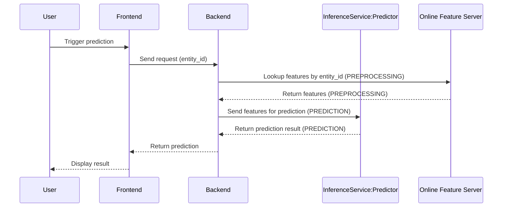
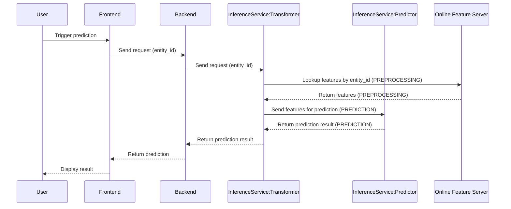

# Move Feature Retrieval to KServe Transformer

In real-time fraud detection, response time and consistency are critical. When serving machine learning models on Kubernetes, the way you integrate feature lookups into your inference flow can have significant architectural implications. Let’s explore two setups and highlight the benefits of offloading feature retrieval to KServe’s built-in **Transformer** component by using the **Feast** online feature server.

## Two Approaches to Feature Retrieval

### Option 1: Feature Lookup in Backend (No Transformer)

In this setup, the **Backend** is responsible for querying the **Online Feature Server (OFS)**, retrieving features based on an input ID (e.g., `entity_id`), and passing the features to the predictor.

### Option 2: Feature Lookup via Transformer

Here, the backend simply passes the raw ID to the InferenceService. The Transformer performs the feature lookup before passing features to the predictor.

## Why Move Feature Retrieval Logic from Backend to Transformer?

Switching to the second architecture—embedding the feature lookup within KServe’s inference pipeline using its Transformer—brings several advantages:

### Simpler Backend Logic

In the first setup, the backend must:

- Know which features to request.
- Understand how to call the online feature server.
- Deal with errors or retries.

In the second setup, the backend becomes a simple pass-through: it just sends a entity_id. The InferenceService encapsulates all feature logic, making the backend more lightweight and maintainable.

### Better Reusability and Portability

Decoupling the feature logic from the backend means multiple clients (mobile, web, partner APIs) can use the same InferenceService without duplicating feature retrieval logic. You can also deploy the same model in different environments without rewriting backend code.

### Stronger Data Security in Backend

By shifting feature retrieval logic to the KServe transformer, you ensure that the backend never directly accesses or handles sensitive feature data. This separation minimizes data exposure risks. For example, in fraud detection, features like historical average transaction amounts may be sensitive and should be kept within the model serving infrastructure.

## Summary

Moving feature retrieval from the backend to a transformer in KServe’s InferenceService creates a cleaner, more consistent, and scalable architecture for real-time fraud detection. With Feast and KServe, it’s easier than ever to centralize feature logic and productionize your models efficiently.