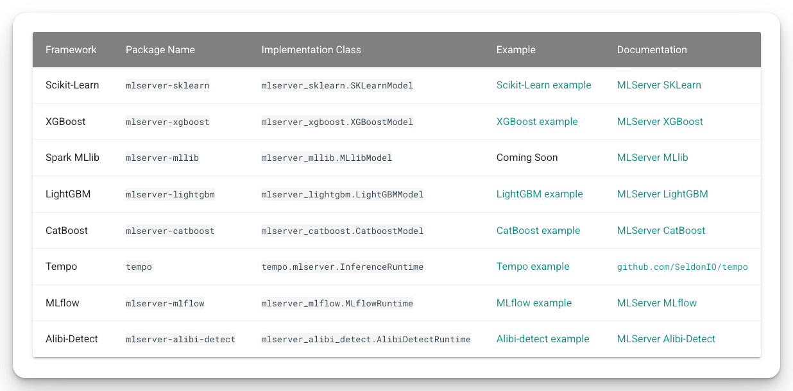
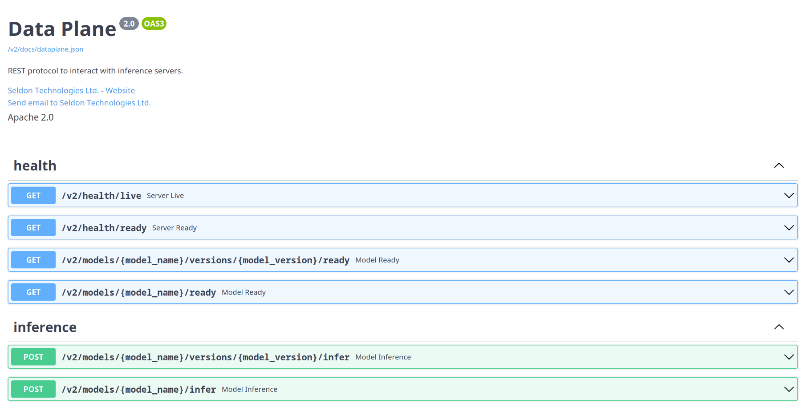
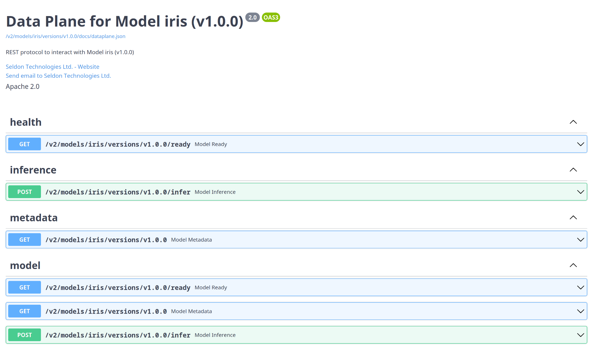

# MLServer

- MLServer is an open source inference server for your machine learning models.
- MLServer aims to provide an easy way to start serving your machine learning models through a REST and gRPC interface

## Inference Runtimes

- Inference runtimes allow you to define how your model should be used within MLServer. You can think of them as the backend glue between MLServer and your machine learning framework of choice.
- Out of the box, MLServer comes with a set of pre-packaged runtimes which let you interact with a subset of common ML frameworks. This allows you to start serving models saved in these frameworks straight away.

<figure markdown="span">
  { width=600 }
  <figcaption>MLServer Inference Runtime</figcaption>
</figure>

<figure markdown="span">
  
  <figcaption>MLServer Supported Inference Runtime</figcaption>
</figure>

## OpenAPI Support

- OpenAPI spec: [dataplane.json](https://mlserver.readthedocs.io/en/latest/_downloads/bf7c41f99b6b8a01894e8c1b6c1d0503/dataplane.json)
- MLServer follows the Open Inference Protocol (previously known as the “V2 Protocol”). fully compliant with [KServing’s V2 Dataplane](https://kserve.github.io/website/master/modelserving/data_plane/v2_protocol/) spec.
- Support Swagger UI: 
    - The autogenerated Swagger UI can be accessed under the `/v2/docs` endpoint.
    - MLServer will also autogenerate a Swagger UI tailored to individual models, showing the endpoints available for each one. under the following endpoints:
        - `/v2/models/{model_name}/docs`
        - `/v2/models/{model_name}/versions/{model_version}/docs`

<figure markdown="span">
  
  <figcaption>MLServer Swagger UI</figcaption>
</figure>

<figure markdown="span">
  
  <figcaption>MLServer Model Swagger UI</figcaption>
</figure>

## Parallel Inference

<figure markdown="span">
  
  <figcaption>MLServer Parallel Inference</figcaption>
</figure>

- Python has some native issues
- The Global Interpreter Lock (GIL) is a mutex lock that exists in most Python interpreters (e.g. CPython). Its main purpose is to lock Python’s execution so that it only runs on a single processor at the same time. This simplifies certain things to the interpreter. However, it also adds the limitation that a single Python process will never be able to leverage multiple cores.
- Out of the box, MLServer overcome the python native issue, to support to offload inference workloads to a pool of workers running in separate processes.
- `parallel_workers` on the `settings.json` file

## Multi-Model Serving(MMs)

- within a single instance of MLServer, you can serve multiple models under different paths. This also includes multiple versions of the same model.

## Adaptive Batching

- MLServer includes support to batch requests together transparently on-the-fly. We refer to this as “adaptive batching”, although it can also be known as “predictive batching”.
- Why? 
    - Maximise resource usage
    - Minimise any inference overhead
- 需要仔細調整，因此MLServer won’t enable by default adaptive batching on newly loaded models.
- Usage: `max_batch_size`, `max_batch_time` on the `model-settings.json` file

## Metrics
    
- Out-of-the-box, MLServer exposes a set of metrics that help you monitor your machine learning workloads in production.
- On top of these, you can also register and track your own custom metrics as part of your custom inference runtimes.
- Default Metrics
    - `model_infer_request_success`: Number of successful inference requests.
    - `model_infer_request_failure`: Number of failed inference requests.
    - `batch_request_queue`: Queue size for the adaptive batching queue.
    - `parallel_request_queue`: Queue size for the inference workers queue.
- REST Metrics
    - `[rest_server]_requests`: Number of REST requests, labelled by endpoint and status code.
    - `[rest_server]_requests_duration_seconds`: Latency of REST requests.
    - `[rest_server]_requests_in_progress`: Number of in-flight REST requests.
- gRPC Metrics
    - `grpc_server_handled`: Number of gRPC requests, labelled by gRPC code and method.
    - `grpc_server_started`: Number of in-flight gRPC requests.

## Reference

- [Inference Runtimes | MLServer](https://mlserver.readthedocs.io/en/latest/runtimes/index.html)
- [Multi-Model Serving | MLServer](https://mlserver.readthedocs.io/en/latest/examples/mms/README.html)