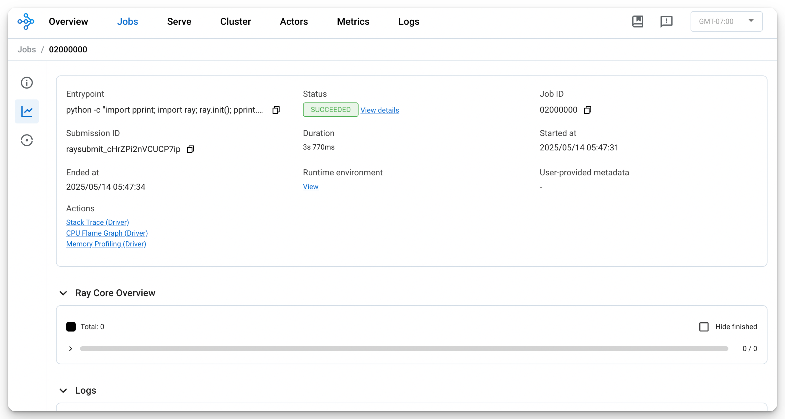

# KubeRay Installation

## 1. Install KubeRay operator

Add kuberay helm repo

```bash
helm repo add kuberay https://ray-project.github.io/kuberay-helm/

"kuberay" has been added to your repositories
```

Update repo

```bash
helm repo update

Hang tight while we grab the latest from your chart repositories...
...Successfully got an update from the "kuberay" chart repository
Update Complete. ⎈Happy Helming!⎈
```

Create namespace

```bash
kubectl create ns kuberay
namespace/kuberay created
```

Create KubeRay Operator

```bash
helm install kuberay-operator kuberay/kuberay-operator --version 1.3.0 -n kuberay

NAME: kuberay-operator
LAST DEPLOYED: Wed May 14 20:29:44 2025
NAMESPACE: kuberay
STATUS: deployed
REVISION: 1
TEST SUITE: None
```

## 2. Validate Installation

Check Operator pod deployed

```bash
kubectl get pods -n kuberay
NAME                                READY   STATUS    RESTARTS   AGE
kuberay-operator-66d848f5cd-5npp6   1/1     Running   0          23s
```

## 3. Deploy a RayCluster custom resource

Install Ray Cluster

```bash
helm install raycluster kuberay/ray-cluster --version 1.3.0 --set 'image.tag=2.41.0-aarch64' -n kuberay

NAME: raycluster
LAST DEPLOYED: Wed May 14 20:31:53 2025
NAMESPACE: kuberay
STATUS: deployed
REVISION: 1
TEST SUITE: None
```

Once the RayCluster CR has been created, you can view it by running:

```bash
kubectl get rayclusters -n kuberay

NAME                 DESIRED WORKERS   AVAILABLE WORKERS   CPUS   MEMORY   GPUS   STATUS   AGE
raycluster-kuberay   1                                     2      3G       0               62s
```

To view Ray cluster’s pods, run the following command

```bash
kubectl get pods --selector=ray.io/cluster=raycluster-kuberay -n kuberay

NAME                                          READY   STATUS    RESTARTS   AGE
raycluster-kuberay-head-k6ktp                 1/1     Running   0          5m49s
raycluster-kuberay-workergroup-worker-zrxbj   1/1     Running   0          5m49s
```

## Submit a Ray job to the RayCluster using ray job submission SDK

Use the Ray job submission SDK to submit Ray jobs to the RayCluster through the Ray Dashboard port where Ray listens for Job requests

```bash
kubectl get service raycluster-kuberay-head-svc -n kuberay

NAME                          TYPE        CLUSTER-IP   EXTERNAL-IP   PORT(S)                                         AGE
raycluster-kuberay-head-svc   ClusterIP   None         <none>        10001/TCP,8265/TCP,6379/TCP,8080/TCP,8000/TCP   13m
```

Use port-forwarding to access the Ray Dashboard port which is 8265 by default

```bash
kubectl port-forward service/raycluster-kuberay-head-svc 8265:8265 -n kuberay > /dev/null &

[1] 79298
```

Now that the Dashboard port is accessible, submit jobs to the RayCluster:

```bash
ray job submit --address http://localhost:8265 -- python -c "import pprint; import ray; ray.init(); pprint.pprint(ray.cluster_resources(), sort_dicts=True)"

Job submission server address: http://localhost:8265

-------------------------------------------------------
Job 'raysubmit_cHrZPi2nVCUCP7ip' submitted successfully
-------------------------------------------------------

Next steps
  Query the logs of the job:
    ray job logs raysubmit_cHrZPi2nVCUCP7ip
  Query the status of the job:
    ray job status raysubmit_cHrZPi2nVCUCP7ip
  Request the job to be stopped:
    ray job stop raysubmit_cHrZPi2nVCUCP7ip

Tailing logs until the job exits (disable with --no-wait):
2025-05-14 05:47:31,082	INFO job_manager.py:530 -- Runtime env is setting up.
2025-05-14 05:47:34,024	INFO worker.py:1514 -- Using address 10.244.0.83:6379 set in the environment variable RAY_ADDRESS
2025-05-14 05:47:34,025	INFO worker.py:1654 -- Connecting to existing Ray cluster at address: 10.244.0.83:6379...
2025-05-14 05:47:34,045	INFO worker.py:1832 -- Connected to Ray cluster. View the dashboard at 10.244.0.83:8265 
{'CPU': 2.0,
 'memory': 3000000000.0,
 'node:10.244.0.83': 1.0,
 'node:10.244.0.84': 1.0,
 'node:__internal_head__': 1.0,
 'object_store_memory': 773958450.0}

------------------------------------------
Job 'raysubmit_cHrZPi2nVCUCP7ip' succeeded
------------------------------------------

```

## See Dashboard

```
127.0.0.1:8265
```




https://docs.ray.io/en/latest/cluster/kubernetes/getting-started/raycluster-quick-start.html