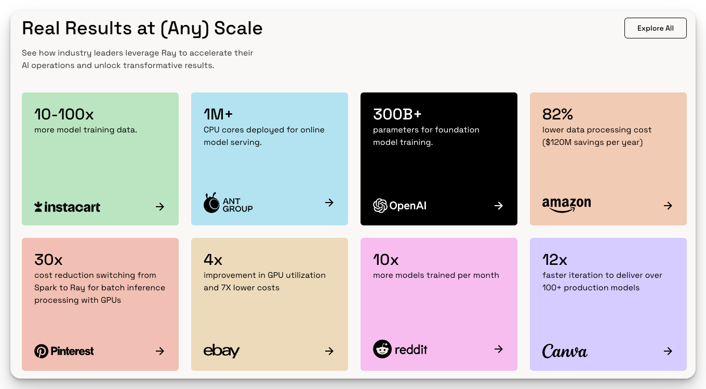

---
tags:
  - Ray
---

# In the Bigger Picture

## History & Current Status

Ray was originally developed by UC Berkeley's RISELab (formerly AMPLab) and was first open-sourced in September 2017.[^1] The project was designed to simplify distributed computing for machine learning and AI workloads. Later, the team spun off a company, Anyscale, Inc.[^2], to maintain and commercialize Ray. As of May 2025, Ray has over 37,000 stars on GitHub.[^3] In April 2024, Thoughtworks included Ray in the Trial phase of its Technology Radar, indicating it is a promising and maturing tool worth evaluating in real-world projects.[^4]

The community is active and growing, with more than 10,000 members on Slack[^5] and over 1,100 contributors on GitHub. Ray is used by more than 23,000 developers and organizations worldwide, including OpenAI, Shopify, and Uber. An annual Ray Summit[^6] brings the community together to share use cases, roadmap updates, and technical deep dives.

<figure markdown="span">
  
  *Ray Use Cases*[^1]
</figure>

## Alternatives

### Distributed Data Processing

*(Generated by ChatGPT 4o Deep Research on 2025/05/20)*

=== "Ray Data"

    An open-source **unified framework** designed to scale Python and AI workloads (such as machine learning) across distributed environments.

    **Pros**

    - **Python-native distributed computing framework** with a flexible and simple interface, avoiding the overhead of the JVM. Especially suitable for data science and ML workloads.
    - **Comprehensive ecosystem** including built-in libraries like Ray Tune, Ray Train, Ray Serve, and RLlib—helpful for building large-scale ML applications.
    - **Abstracts distributed complexity** by offering parallel computing primitives, enabling non-experts in distributed systems to easily get started.

    **Cons**

    - **Lacks high-level data processing interfaces**: Ray Datasets only supports basic parallel processing; it lacks full ETL capabilities like rich querying, visualization, or aggregations. It's not positioned as a full data science ETL solution.
    - **Scheduling overhead for many small tasks**: Ray may incur non-trivial overhead when managing a large number of tiny tasks (batching is often needed). Compared to mature big data engines, its stability and tuning experience are still evolving.

    **When to Use**

    - **Distributed Python computation / ML**: Ideal when you need to scale arbitrary Python or ML pipelines (e.g., hyperparameter tuning, distributed training, reinforcement learning).
    - **Heterogeneous resource scheduling**: Suited for workloads requiring GPUs, TPUs, or managing multiple concurrent tasks like data preprocessing and training.

=== "Apache Spark"

    A unified analytics engine for large-scale data processing. Offers APIs in Scala, Java, Python, and supports batch, streaming, and ML workloads.

    **Pros**

    - **Strong big data processing capabilities**: Stable and battle-tested, Spark is the de facto standard for distributed computing on large datasets.
    - **Robust ecosystem**: A unified platform supporting SQL (Spark SQL), DataFrame APIs (pandas API on Spark), machine learning (MLlib), graph computation (GraphX), and streaming (Structured Streaming).
    - **Widespread adoption and support**: Large community and broad industry usage, with extensive third-party integrations and enterprise support.

    **Cons**

    - **Indirect Python support**: Spark runs on the JVM, and PySpark uses serialization to move data between Python and the JVM. Heavy use of Python UDFs may introduce performance overhead. Also lacks the interactive, dynamic experience native Python users are used to.
    - **High resource overhead**: Cluster startup and scheduling can be expensive, especially for small-to-medium workloads. Lightweight alternatives may outperform Spark in such scenarios.

    **When to Use**

    - **Massive-scale batch data processing**: Best suited for terabyte-to-petabyte-scale jobs, especially if Hadoop/Spark infrastructure is already in place. Ideal for complex ETL, warehousing, and batch analytics.
    - **All-in-one platform requirements**: Excellent when you need a unified stack offering SQL, ML, and streaming in one platform.

=== "Dask"

    A flexible Python parallel computing library that extends the PyData ecosystem (like Pandas/NumPy) to handle distributed or out-of-core computation.

    **Pros**

    - **Familiar interface**: Easy to adopt for Python users, with APIs that closely resemble Pandas. You can scale up existing Pandas/NumPy code with minimal changes.
    - **Lightweight and flexible**: Can run on a single machine and scale to a cluster. More suitable than Spark for medium-sized data workloads with lower deployment overhead.
    - **General-purpose parallel computing**: Supports not just DataFrames but also Dask Array, Dask Delayed, and Dask Futures—enabling parallelization of arbitrary Python code and numerical operations.

    **Cons**

    - **Limited scalability at extreme data volumes**: For jobs over 1TB, memory management and scheduling can become difficult. Spark may outperform Dask in such scenarios. Also lacks a mature query optimizer for complex joins and aggregations.
    - **Partial API limitations**: Dask's data structures are immutable and do not support some in-place Pandas operations (like `.loc` assignment). You may need to use `map_partitions` and other patterns. Some Pandas edge behaviors may also differ, requiring a learning curve.

    **When to Use**

    - **Data science in Python with medium-scale data**: Ideal for datasets from a few GBs to several TBs, especially if you're already using Pandas/Numpy and want to speed up existing code with parallelism.
    - **Flexible and custom computation**: Useful for local development that later scales to clusters. Suitable when the workload involves custom Python functions and numerical computations, rather than pure SQL. Also great for scientific computing tasks that need fault tolerance and visualized scheduling.

=== "Daft"

    A new-generation unified data engine offering both Python DataFrame and SQL interfaces. Built in Rust for high performance, with seamless scaling from local to petabyte-scale distributed execution.

    **Pros**

    - **High performance and unified interface**: Supports both DataFrame-style operations and SQL queries. Built in Rust and based on Apache Arrow memory format for fast local processing. Scales to distributed clusters via integration with Ray. Benchmarks show significant performance gains over Spark and Dask.
    - **Supports complex data types**: Designed for multimodal data like images, videos, and embeddings, with built-in functions and type support to simplify processing of unstructured data.
    - **Query optimization and cloud integration**: Includes a built-in query optimizer (e.g., predicate pushdown, cost estimation). Integrates with data catalogs like Iceberg/Delta and cloud storage like S3, achieving fast I/O in cloud environments.

    **Cons**

    - **Immature ecosystem**: Still in early (0.x) development stages. Community and ecosystem are limited compared to Spark or Dask. Lacks extensive tooling and production-grade stability.
    - **Requires external tools for distributed execution**: Daft focuses on data processing itself. Distributed resource management is delegated to Ray, which adds extra setup and operational complexity.
    - **Incomplete feature set**: Some advanced analytics features are still under development. API stability and error messaging could be improved compared to mature engines.

    **When to Use**

    - **High-performance Python workloads with complex data**: Great for handling unstructured data like images, videos, and embeddings at scale, especially when you want to stay in the Python ecosystem.
    - **Seamless local-to-distributed scaling**: Ideal for teams looking to prototype locally using DataFrames and easily scale to clusters/cloud later. A good alternative to Spark/Dask for scenarios needing both SQL and Python transformations in a performant pipeline.

### Distributed HPO

*(Generated by ChatGPT 4o Deep Research on 2025/05/20)*

=== "Ray Tune"

    A Python library for experiment execution and hyperparameter tuning at any scale.

    **Pros**

    - **Wide algorithm support**:Supports a wide range of state-of-the-art search algorithms (e.g. PBT, HyperBand/ASHA) and integrates with many optimization libraries like Optuna, HyperOpt, Ax, Nevergrad, etc. This allows users to leverage cutting-edge tuning methods easily.
    - **Scalable and distributed**:Can parallelize and distribute trials across multiple CPUs/GPUs and even multiple nodes using Ray's cluster architecture, often without any code changes. This makes it simple to scale up experiments from a laptop to a distributed cluster.
    - **Easy integration**:Provides a simple Python API that works seamlessly with popular ML frameworks (TensorFlow, PyTorch, scikit-learn, etc.). It also offers convenient tools (like TensorBoard logging) for monitoring experiments, lowering the learning curve for new users.

    **Cons**

    - **Kubernetes integration not native**:Ray Tune is not built into Kubernetes; running it on K8s requires deploying a Ray cluster (e.g. via the KubeRay operator), which is extra overhead compared to a K8s-native solution.
    - **Python-centric**:It's primarily a Python library, so each trial runs in a Python process. This makes it less language-agnostic than a tool like Katib – non-Python workloads are not as straightforward to tune with Ray Tune.
    - **Resource overhead**: Using Ray introduces additional background processes and resource usage (for the Ray runtime). For very small-scale or simple hyperparameter searches, this added complexity can be overkill when a lightweight tool (like Optuna alone) might suffice.

    **When to Use**

    - Use Ray Tune when you want to perform hyperparameter search **inside a Python workflow** (e.g. in a Jupyter notebook or script) and **easily scale** it from local execution to distributed runs without changing your code.
    - It is a good choice if you **don't have a Kubernetes infrastructure** or prefer not to rely on one. Ray Tune can manage distributed training on its own (on VMs or a Ray cluster) and thus suits scenarios where setting up Kubeflow/Katib would be too heavyweight.

=== "Katib"

    An open-source, Kubernetes-native hyperparameter tuning system that is framework-agnostic and supports AutoML features like early stopping and NAS.

    **Pros**

    - **Kubernetes-native**: Designed to run as part of a K8s cluster, Katib treats hyperparameter tuning jobs as Kubernetes workloads. This tight integration makes it a natural fit for cloud-native environments and enables multi-tenant usage in production (multiple users can share the service). It seamlessly works with Kubeflow, allowing tuning to plug into pipelines and Kubernetes resource management.
    - **Framework/language agnostic**: Katib can tune any model training code in any language or framework, as long as it's containerized. It's not tied to a specific ML library – whether you use TensorFlow, PyTorch, R, or even a custom script, Katib can run it because it launches jobs in containers.
    - **Rich algorithm library**: Offers diverse hyperparameter search strategies out-of-the-box: random search, grid search, Bayesian optimization (via Skopt), Hyperband/ASHA, CMA-ES, Tree of Parzen Estimators (TPE), Population Based Training, and more. It's integrated with libraries like Hyperopt/Optuna to provide state-of-the-art optimization methods. Katib even supports advanced AutoML techniques such as neural architecture search (NAS) and early stopping criteria, which few other open-source tools provide.

    **Cons**

    - **Kubernetes dependency**: Katib requires a Kubernetes environment (typically as part of Kubeflow) to run. This means it's not usable in a simple local setup and has a higher operational overhead if you don't already have a K8s cluster.
    - **Higher learning curve**: Configuring Katib experiments involves writing Kubernetes CRD (YAML) configurations for experiments, parameters, and metrics. Users must understand Kubernetes concepts and Katib's CRD schema, which can be less straightforward than using a Python library API. This complexity can slow down initial experimentation, especially for those new to K8s.
    - **Beta-stage project**: As of now, Katib is in beta status. While it is used in production by some, certain features or integrations may not be as mature or well-documented as more established libraries. It largely relies on the Kubeflow ecosystem, so using it outside of Kubeflow/Kubernetes contexts might not be practical.

    **When to Use**

    - Use Katib when you are working in a **Kubernetes-based ML platform** (especially with Kubeflow) and want a hyperparameter tuning service that integrates naturally with your cluster jobs and pipelines.
    - It is the go-to choice if you need to **tune heterogeneous workloads or non-Python applications**. For example, if your training code is in R, Java, or any framework outside of Python, Katib's container-based approach allows you to optimize those just as easily. Similarly, if you have an existing training pipeline (e.g., a Kubeflow TFJob/PyTorchJob), Katib can hook into it to adjust hyperparameters.
    - Choose Katib for **large-scale or collaborative scenarios**: it supports multi-user (multi-tenant) usage and distributed training jobs natively. If you require advanced AutoML features like NAS or want a centrally managed HPO service for your team or organization, Katib provides these capabilities in a cloud-native way.

### Model Serving

*(Generated by ChatGPT 4o Deep Research on 2025/05/20)*

=== "Ray Serve"

    Ray Serve is an open-source, scalable model serving library built on Ray, allowing you to serve machine learning models (and arbitrary Python business logic) as high-performance, resilient web services. It's framework-agnostic and can run anywhere Ray can (from a laptop to a Kubernetes cluster) with minimal code changes.

    **Pros**

    - **Flexible model composition and Python-first workflow:** You can deploy multiple models and custom business logic in a single pipeline, all in Python code, which makes it easy to develop and test locally before scaling up. Ray Serve's integration with FastAPI also simplifies turning your code into RESTful endpoints.
    - **Scalable and resource-efficient:** Built on the Ray distributed computing framework, it natively scales across CPU/GPU nodes and even multiple machines. It supports fine-grained resource control (e.g. fractional GPUs and auto-batching), enabling high throughput serving and efficient utilization of hardware. Ray's autoscaler can dynamically add or remove replicas based on load.
    - **Kubernetes integration optional:** Unlike purely Kubernetes-focused tools, Ray Serve doesn't *require* K8s – you can start on a local machine or VM and later use KubeRay (Ray's K8s operator) to deploy to a cluster without major code changes. This lowers the barrier to entry while still allowing cloud-native deployment when needed.

    **Cons**

    - **Not a full ML platform:** Ray Serve focuses on serving and lacks built-in model lifecycle management features (no native model registry/versioning UI or advanced monitoring dashboards). You may need to implement or integrate external tools for model tracking, canary testing, or extensive metrics.
    - **Operational overhead of Ray:** Using Ray Serve means running a Ray cluster, which introduces additional complexity and resource overhead. Deploying on Kubernetes, for example, requires operating the Ray runtime (via an operator or manual setup), which can be overkill if you only need simple single-model serving. 
    - **Limited traffic-splitting out-of-the-box:** There's no built-in canary or A/B traffic management API (unlike KServe or Seldon's declarative canary support). Achieving A/B tests would require custom logic in your application (e.g. routing requests between Ray Serve deployments manually).

    **When to Use**

    - **Dynamic or complex inference pipelines:** Use Ray Serve when your application involves multiple models or steps that need to be composed and scaled together (for example, an ensemble or a workflow of preprocessing → model A → model B). Its ability to handle distributed workflows and call one deployment from another shines in these scenarios.
    - **Scaling Python services from prototyping to production:** If you want to prototype a model service locally (using pure Python) and later seamlessly scale it to a cluster or cloud environment without rewriting for a new serving stack, Ray Serve is an excellent choice. It's ideal for teams already using Ray for other tasks (training, tuning) who want to reuse that infrastructure for serving.
    - **Resource-intensive models with custom logic:** When you need fine-grained control over resource allocation (e.g. serving large models with fractional GPU sharing) or have custom Python logic alongside predictions, Ray Serve provides the flexibility and performance to meet those needs. It's well-suited if your use case doesn't fit the one-model-per-container paradigm of other frameworks.

=== "BentoML"

    BentoML is an open-source platform that simplifies packaging and deploying ML models at scale. It provides a unified, framework-agnostic way to containerize models (into a self-contained “Bento” bundle) and deploy them to various environments with minimal coding, bridging the gap between model development and production deployment.

    **Pros**

    - **Easy and developer-friendly:** BentoML offers a simple Python API to package models and serve them, which means you can deploy a model with just a few lines of code. It requires minimal setup and no deep Kubernetes knowledge to get started – great for small teams or startups to quickly ship models as microservices. The development workflow is very “pythonic” and supports local testing (e.g., you can run a Bento service locally like any Flask app).
    - **Framework-agnostic & portable:** It supports a wide range of ML frameworks (TensorFlow, PyTorch, Scikit-learn, Hugging Face transformers, etc.) and can deploy to multiple targets – from Docker containers on your infrastructure to serverless platforms or Kubernetes via Bento's operator/Yatai service. This flexibility lets you use the same packaged model artifact across different environments, avoiding lock-in to a specific serving backend.
    - **Built-in tooling for deployments:** BentoML automatically generates REST/gRPC API servers for your model and includes basic observability features. For example, it has integrated logging and monitoring hooks – you can get inference metrics and logs, and even integrate with Prometheus/Grafana for live monitoring. It also supports versioning your models and services, which makes it possible to do A/B tests or canary releases by deploying multiple versions of a model and routing traffic accordingly.

    **Cons**

    - **Not ideal for extreme scale:** While BentoML can handle moderate production workloads, it isn't as optimized for massive scale or ultra-low latency scenarios as some specialized serving systems. Horizontal scaling (e.g., running many replicas) isn't managed by BentoML itself – you'd rely on Kubernetes or an external orchestrator to scale out, which adds extra work. For very high-throughput or large numbers of models, the overhead of each Bento service and the absence of built-in autoscaling means it might not be the most resource-efficient choice.
    - **Lacks native Kubernetes integration:** Unlike KServe or Seldon, BentoML doesn't deploy via a Kubernetes CRD by default. You either use BentoML's CLI/Yatai to build a container and deploy it, or manually handle the Kubernetes deployment (e.g., create your own Kubernetes Deployment/Service for the Bento container). This means features like canary routing or auto-scaling must be set up through Kubernetes or other tools, not toggled via BentoML configs.
    - **Limited built-in MLOps features:** BentoML focuses on the serving container and basic logging/metrics. It doesn't natively provide advanced monitoring dashboards, data drift detection, or experiment tracking – you'd integrate external tools for those needs. Similarly, governance features (like role-based access, model approval workflows, etc.) are not part of the open-source BentoML, though some are offered in BentoCloud. In short, it's a lightweight serving tool rather than a full-fledged enterprise ML platform.

    **When to Use**

    - **Rapid prototyping and small-to-medium deployments:** Use BentoML when you want to go from a trained model to a deployed service quickly with minimal overhead – for instance, a small team that needs to frequently deploy models for different projects. It shines in early-stage production scenarios where simplicity and speed are favored over complex infrastructure.
    - **Polyglot model environments:** If your use case involves various model types (different frameworks or libraries) and you need a consistent way to package and deploy all of them, BentoML is a good fit. It provides one standardized workflow to containerize models from any framework and deploy to your environment of choice.
    - **Customization and control in Python:** When you require custom pre- or post-processing logic, or want to integrate business logic into your prediction service, BentoML allows you to write that logic in Python alongside model inference. This is useful in scenarios where alternative tools (which often auto-launch models in generic servers) don't easily support custom code. In BentoML, you have full control to define the request handling, which can be handy for experimental features or complex input/output handling.

=== "KServe"

    KServe (formerly KFServing) is a Kubernetes-native model serving platform that provides a Custom Resource Definition (CRD) called `InferenceService` to deploy ML models on Kubernetes in a standardized way. It focuses on “serverless” inference – automatically scaling model servers up and down (even to zero) based on traffic – and supports many popular ML frameworks out-of-the-box.

    **Pros**

    - **Deep Kubernetes integration:** KServe defines an `InferenceService` CRD for model deployments, which makes it feel like a natural extension of Kubernetes. You can deploy models by simply specifying the model artifact (e.g., a URI to a saved model on cloud storage) and selecting an appropriate runtime (TensorFlow Serving, TorchServe, scikit-learn, XGBoost, etc.), without needing to write custom serving code. This declarative approach is convenient for teams already comfortable with `kubectl` and YAML.
    - **Serverless autoscaling (Knative):** KServe leverages Knative Serving under the hood to handle scaling. It can automatically scale up replicas based on request load and scale down to zero when no traffic is present. This on-demand scaling is efficient for cost and resource usage, and it works for CPU and GPU workloads alike. Built-in autoscaling metrics and concurrency controls help handle spikes in traffic.
    - **Advanced deployment strategies:** It supports canary deployments and traffic splitting natively. You can deploy a new version of a model and direct a percentage of traffic to it (for A/B testing or gradual rollouts) using simple CRD fields. KServe also introduced inference graphs, allowing you to chain models or have ensembles within a single `InferenceService` (though this is somewhat basic compared to Seldon's graphs). Additionally, KServe supports standard ML endpoint protocols (like KFServing V2 and even the OpenAI API schema for generative models) for interoperability.

    **Cons**

    - **Setup complexity:** Installing and managing KServe can be complex. It typically requires deploying Knative and Istio (for networking) on your Kubernetes cluster, which means extra moving parts. This overhead implies you need solid Kubernetes/cloud-native expertise to operate it. Teams without existing K8s infrastructure might find it heavyweight.
    - **Limited flexibility for custom code:** KServe excels at serving pretrained models with standard predictors, but if you need custom pre-processing, post-processing, or arbitrary Python logic, it's less straightforward. You often have to build a custom docker image implementing KServe's SDK interfaces for transformers or predictors. In comparison, tools like Seldon or BentoML (or writing your own service) may offer more flexibility for custom inference logic.
    - **Fewer built-in MLOps features:** While KServe covers the basics of scaling and canarying, it doesn't inherently provide some advanced features like data drift detection, out-of-the-box monitoring dashboards, or automatic logging of requests/responses – those would rely on integrating with other tools (e.g., Prometheus for metrics, Kubeflow or custom pipelines for data logging). In areas like explainability or outlier detection, KServe is more bare-bones than Seldon Core's extensive feature set.

    **When to Use**

    - **Kubernetes-first organizations:** Choose KServe if your team is already invested in Kubernetes (possibly also using Kubeflow) and you want a model serving solution that fits natively into that ecosystem. It's ideal when you prefer deploying models via Kubernetes manifests and want the control of K8s primitives (like using HPA, etc.) with the convenience of not writing a serving application from scratch.
    - **Multiple models, multiple frameworks:** KServe is well-suited when you have models in different frameworks and want a unified way to serve them. Because it provides built-in support for many framework servers, you can hand off a TensorFlow model or a PyTorch model to KServe in a similar fashion. This makes it easier to standardize deployment in a heterogeneous ML environment.
    - **Auto-scaling API endpoints:** If your use case demands elastic scaling (including scale-to-zero) to handle sporadic or bursty traffic patterns, and you want to pay for/use resources only on-demand, KServe's Knative-based design is a strong advantage. It also allows gradual rollouts of new model versions easily. In summary, use KServe for production scenarios where you need robust scaling and traffic management for your model APIs, and you're okay with the operational overhead of maintaining the KServe/Knative stack.

=== "Seldon Core"

    Seldon Core is an open-source MLOps framework for deploying, managing, and monitoring machine learning models at scale on Kubernetes. It converts your models into production-ready microservices and offers an advanced set of deployment features (from experiments and ensembles to explainers and outlier detectors) to support complex production ML use cases.

    **Pros**

    - **Rich feature set for production ML:** Seldon Core provides many advanced capabilities out-of-the-box: you can do A/B testing and canary rollouts of models, incorporate explainability (e.g., SHAP values) and outlier detection in your deployments, and even define inference graphs to chain multiple models or preprocessing steps. These features make it possible to implement complex deployment strategies (multi-armed bandits, shadow deployments, etc.) with the framework's support rather than building those from scratch.
    - **Scales to enterprise needs:** Designed to handle deployments of potentially thousands of models, Seldon is built with scalability in mind . It uses a CRD (`SeldonDeployment`) to deploy models on Kubernetes, and can manage scaling via standard Kubernetes mechanisms (e.g., Horizontal Pod Autoscalers). It also supports numerous frameworks and languages (you can deploy models from TensorFlow, PyTorch, Scikit-learn, or even custom predictors in languages like Java) giving it versatility in complex organizations.
    - **Integrated with monitoring and governance tools:** Seldon has native integrations for metrics and logging – it works well with Prometheus/Grafana for monitoring and can emit detailed metrics about predictions. It also leverages Istio for traffic routing and security policies in Kubernetes. Moreover, it can integrate with workflow orchestrators (Airflow, Argo, Kubeflow Pipelines) and includes audit and logging components, which is useful for governance and compliance in enterprise settings.

    **Cons**

    - **High complexity and setup overhead:** Seldon Core's powerful features come at the cost of complexity. Setting up Seldon Core involves deploying its operators and (often) integrating with Istio for ingress, plus configuring all the CRD specs properly – this requires significant Kubernetes expertise. The learning curve is steep, and for small projects the resource overhead (multiple pods for controllers, sidecars for logging/metrics, etc.) can be heavy.
    - **Documentation and usability challenges:** Some of Seldon's more advanced features (like complex inference graphs or custom routers) are not trivial to implement and the documentation/examples can be lacking. This means that while those features exist, leveraging them may require considerable experimentation and community support. In contrast, simpler frameworks might get you from zero to serving faster if your needs are basic.
    - **Potential overkill for simple use cases:** If you just need to deploy one or two models with straightforward inference, Seldon can be over-engineered. The overhead of its components and the requirement to containerize your model to fit Seldon's runtime might slow you down unnecessarily. In such cases, a lighter-weight solution (like BentoML or a simple Flask app) could be more appropriate. Seldon really shines in more demanding scenarios, not one-off model deploys.

    **When to Use**

    - **Enterprise-scale deployments with advanced requirements:** Seldon Core is an excellent choice when you are dealing with large-scale ML systems in production – for example, a situation where you have many models or microservices and you need sophisticated routing (A/B tests, canaries) and monitoring on all of them. If reliability, traceability, and robust governance are top priorities (as in regulated industries or mission-critical ML), Seldon's comprehensive features are very valuable.
    - **Need for out-of-the-box MLOps features:** If your use cases demand things like real-time explainability of model decisions, automatic outlier or drift detection, or complex inference pipelines (ensembles, cascades of models) and you prefer having these capabilities ready-made, Seldon Core provides them built-in. It's a suitable framework when you want to avoid implementing these features from scratch and are willing to invest time in mastering Seldon's framework.
    - **Kubernetes-heavy environments with expert DevOps:** Use Seldon when you have a strong DevOps/MLOps team familiar with Kubernetes who can maintain the infrastructure. In scenarios where the ML platform is a first-class part of the engineering organization, Seldon Core gives a lot of control and can be tuned to very specific needs. It's often used in tandem with Kubeflow or other K8s tools in companies building out a full ML platform. If your team has the bandwidth to handle a more complex system for the sake of advanced functionality, Seldon is a top contender.

[^1]: [Ray](https://www.ray.io/)
[^2]: [Anyscale, Inc.](https://www.anyscale.com/)
[^3]: [Ray | GitHub](https://github.com/ray-project/ray)
[^4]: [Ray | Technology Radar | Thoughtworks](https://www.thoughtworks.com/radar/languages-and-frameworks/ray)
[^5]: [Join Ray Slack | Ray](https://www.ray.io/join-slack)
[^6]: [Ray Summit 2024](https://www.anyscale.com/ray-summit/2024)
[^7]: [Comparing Ray Data to other systems | Ray Docs](https://docs.ray.io/en/latest/data/comparisons.html)
[^8]: [Spark, Dask, and Ray: choosing the right framework](https://domino.ai/blog/spark-dask-ray-choosing-the-right-framework)
[^9]: [Offline Batch Inference: Comparing Ray, Apache Spark, and SageMaker](https://www.anyscale.com/blog/offline-batch-inference-comparing-ray-apache-spark-and-sagemaker)
