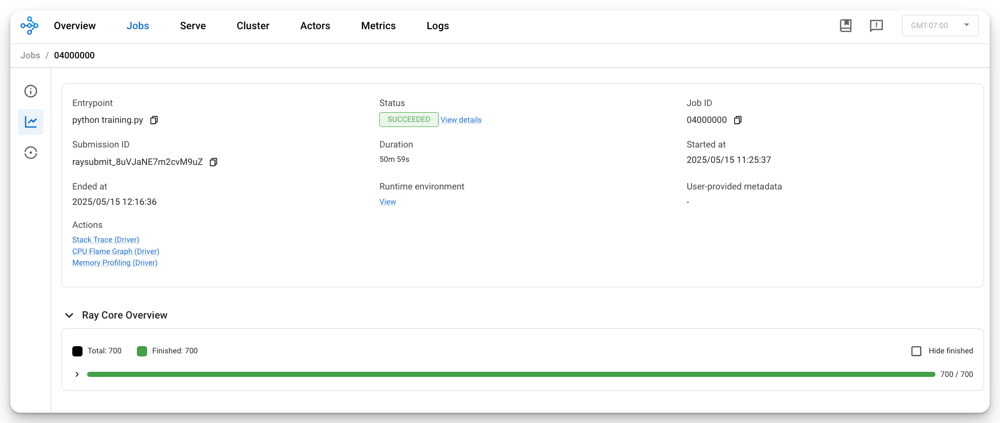
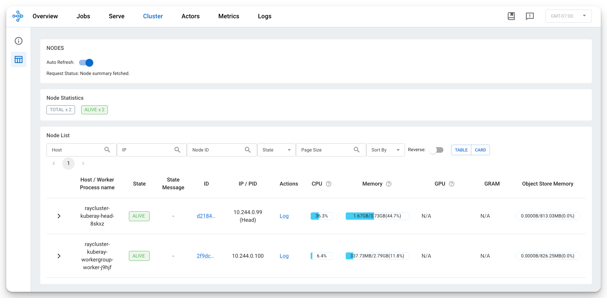
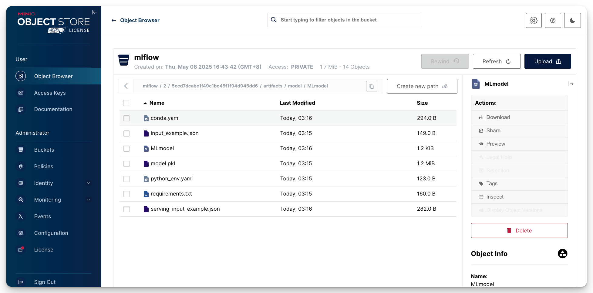

# Submit a Ray Tune Job to Your Ray Cluster


Use the Ray job submission SDK to submit Ray jobs to the RayCluster through the Ray Dashboard port where Ray listens for Job requests

```bash
kubectl get service raycluster-kuberay-head-svc -n kuberay
```

```
NAME                          TYPE        CLUSTER-IP   EXTERNAL-IP   PORT(S)                                         AGE
{==raycluster-kuberay-head-svc==}   ClusterIP   None         <none>        10001/TCP,8265/TCP,6379/TCP,8080/TCP,8000/TCP   13m
```

Use port-forwarding to access the Ray Dashboard port which is `8265` by default

```bash
kubectl port-forward service/{==raycluster-kuberay-head-svc==} {==8265:8265==} -n kuberay > /dev/null &
```

```
[1] 56915
```

## Prepare Runtime Environment

```yaml
--8<-- "./ray/runtime-env.yaml"
```

```
--8<-- "./ray/requirements.txt"
```


## Submit a Ray Job to the Ray Cluster Using `ray job submit`

Now that the Dashboard port is accessible, submit jobs to the Ray Cluster:

```sh
--8<-- "./ray/ray-job-submit-command.txt"
```

```
Job submission server address: {==http://localhost:8265==}
2025-05-16 02:19:52,245	INFO dashboard_sdk.py:338 -- Uploading package gcs://_ray_pkg_927761c1b60fb91e.zip.
2025-05-16 02:19:52,245	INFO packaging.py:576 -- Creating a file package for local module '.'.

-------------------------------------------------------
Job '{==raysubmit_BBH7MarwNjHRu59z==}' submitted successfully
-------------------------------------------------------

Next steps
  Query the logs of the job:
    ray job logs raysubmit_BBH7MarwNjHRu59z
  Query the status of the job:
    ray job status raysubmit_BBH7MarwNjHRu59z
  Request the job to be stopped:
    ray job stop raysubmit_BBH7MarwNjHRu59z

Tailing logs until the job exits (disable with --no-wait):
2025-05-15 11:19:52,389	INFO job_manager.py:531 -- {==Runtime env is setting up==}.
[I 2025-05-15 11:21:54,810] {==A new study created in memory with name: optuna==}
2025-05-15 11:21:56,460	INFO worker.py:1554 -- Using address 10.244.0.99:6379 set in the environment variable RAY_ADDRESS
2025-05-15 11:21:56,465	INFO worker.py:1694 -- Connecting to existing Ray cluster at address: {==10.244.0.99:6379==}...
2025-05-15 11:21:56,485	INFO worker.py:1888 -- {==Connected to Ray cluster==}.
╭────────────────────────────────────────────────────╮
│ Configuration for experiment     fraud_detection   │
├────────────────────────────────────────────────────┤
│ Search algorithm                 SearchGenerator   │
│ Scheduler                        FIFOScheduler     │
│ Number of trials                 {==100==}               │
╰────────────────────────────────────────────────────╯

View detailed results here: ray/fraud_detection
To visualize your results with TensorBoard, run: `tensorboard --logdir /tmp/ray/session_2025-05-15_11-18-04_381196_1/artifacts/2025-05-15_11-22-03/fraud_detection/driver_artifacts`

...
...
...
...
...

------------------------------------------
Job '{==raysubmit_BBH7MarwNjHRu59z==}' succeeded
------------------------------------------

```

## See Dashboard

```
127.0.0.1:8265
```


https://docs.ray.io/en/latest/cluster/kubernetes/getting-started/raycluster-quick-start.html







