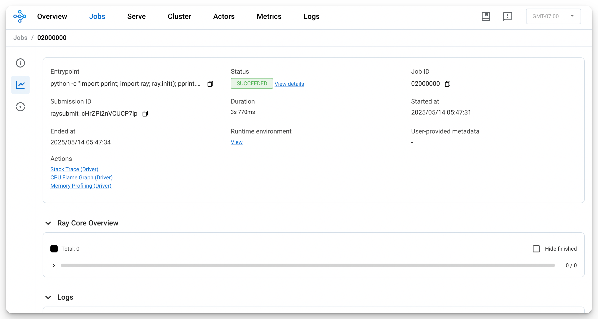
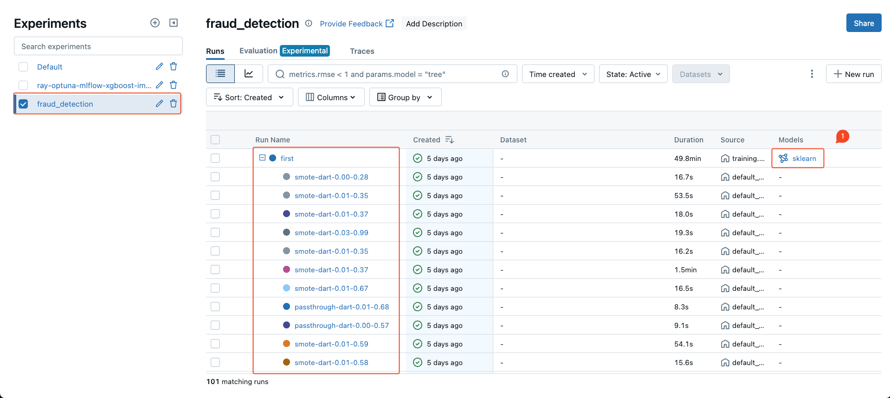
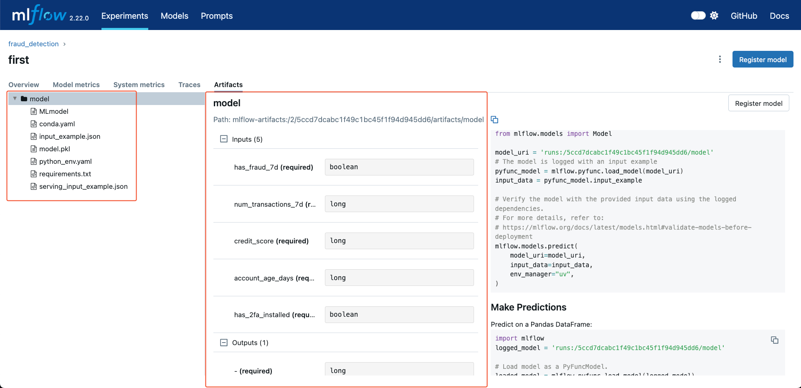

# Submit a Ray Tune Job to Your Ray Cluster

In this guide, we'll walk through how to submit the Ray Tune script we created in the previous article to a Ray cluster. There are three main methods:

1. Using the Ray Jobs API[^1], either
    - Ray Jobs CLI[^2][^3]
    - Ray Jobs Python SDK[^4][^5]
2. Defining a `RayJob` custom resource and submitting it through the Kubernetes Operator.[^6]
3. Executing the job interactively from the head node (not recommended).

Each method has its ideal use case:

When to Use Ray Jobs API

- **Local Development and Testing**: Perfect for quick iterations or debugging directly on a local or remote Ray cluster without dealing with Kubernetes complexity.
- **Ad-Hoc or Short-Lived Jobs**: Ideal for submitting one-off tasks via the API to an existing Ray cluster.

When to Use `RayJob` on Kubernetes

- **Automated Cluster Lifecycle Management**: Ideal when you want Kubernetes to automatically spin up and tear down Ray clusters for each job.
- **Leverage Kubernetes-Native Features**: Useful when integrating with scheduling policies, resource quotas, monitoring tools, or other native Kubernetes features.

In this guide, we'll use Ray Jobs CLI for submitting our Ray Tune job to the cluster.

## Port Forward

Since our Ray Cluster wasn't exposed via a LoadBalancer or NodePort, we'll use port forwarding to access the Ray Dashboard (which runs on port `8265` by default):

```bash
kubectl get service raycluster-kuberay-head-svc -n kuberay
```

```
NAME                          TYPE        CLUSTER-IP   EXTERNAL-IP   PORT(S)                                         AGE
{==raycluster-kuberay-head-svc==}   ClusterIP   None         <none>        10001/TCP,8265/TCP,6379/TCP,8080/TCP,8000/TCP   13m
```

```bash
kubectl port-forward service/{==raycluster-kuberay-head-svc==} {==8265:8265==} -n kuberay > /dev/null &
```

```
[1] 56915
```

We can now access the Ray Cluster dashboard at `http://127.0.0.1:8265`.


## Prepare Runtime Environment

Before launching the Ray Tune job, we need to make sure that each trial's worker process has the correct runtime environment—such as the working directory and required dependencies. We'll define this using a `runtime-env.yaml` and a `requirements.txt`, and pass them along during job submission.

```yaml title="runtime-env.yaml"
--8<-- "./data2ml-ops/ray/runtime-env.yaml"
```

``` title="requirements.txt"
--8<-- "./data2ml-ops/ray/requirements.txt"
```

The runtime environment can be specififed via[^7]

- `ray job submit --runtime-env=...`: the runtime environments are applied to both the driver process (entrypoint script) and the worker processes (all the tasks and actors created from the drive process)
- `ray.init(rutime_env=...)` : the runtime environments are applied to the workers processes (all the tasks and actors), but not the driver process (entrypoint script).


The runtime environment can include one or more fields below:[^8][^9]

- `working_dir`
- `py_modules`
- `py_executable`
- `excludes`
- `pip`
- `uv`
- `conda`
- `env_vars`
- `image_uri`
- `config`

Runtime environments and Docker can work hand in hand or independently, depending on your needs. For example, you might rely on a container image in the Cluster Launcher to manage large or static dependencies, while runtime environments are better suited for dynamic, job-specific configurations. When combined, the runtime environment extends the container image, inheriting its packages, files, and environment variables to provide a seamless and flexible setup.[^10]

## Submit a Ray Job to the Ray Cluster

With the dashboard accessible and runtime environment prepared, you can now submit the Ray Tune job to the cluster:

```sh title="ray-job-submit-command.txt"
--8<-- "./data2ml-ops/ray/ray-job-submit-command.txt"
```

```
Job submission server address: {==http://localhost:8265==}
2025-05-16 02:19:52,245	INFO dashboard_sdk.py:338 -- Uploading package gcs://_ray_pkg_927761c1b60fb91e.zip.
2025-05-16 02:19:52,245	INFO packaging.py:576 -- Creating a file package for local module '.'.

-------------------------------------------------------
Job '{==raysubmit_8uVJaNE7m2cvM9uZ==}' submitted successfully
-------------------------------------------------------

Next steps
  Query the logs of the job:
    ray job logs raysubmit_8uVJaNE7m2cvM9uZ
  Query the status of the job:
    ray job status raysubmit_8uVJaNE7m2cvM9uZ
  Request the job to be stopped:
    ray job stop raysubmit_8uVJaNE7m2cvM9uZ

Tailing logs until the job exits (disable with --no-wait):
2025-05-15 11:19:52,389	INFO job_manager.py:531 -- {==Runtime env is setting up==}.
[I 2025-05-15 11:21:54,810] {==A new study created in memory with name: optuna==}
2025-05-15 11:21:56,460	INFO worker.py:1554 -- Using address 10.244.0.99:6379 set in the environment variable RAY_ADDRESS
2025-05-15 11:21:56,465	INFO worker.py:1694 -- Connecting to existing Ray cluster at address: {==10.244.0.99:6379==}...
2025-05-15 11:21:56,485	INFO worker.py:1888 -- {==Connected to Ray cluster==}.
╭────────────────────────────────────────────────────╮
│ Configuration for experiment     fraud_detection   │
├────────────────────────────────────────────────────┤
│ Search algorithm                 SearchGenerator   │
│ Scheduler                        FIFOScheduler     │
│ Number of trials                 {==100==}               │
╰────────────────────────────────────────────────────╯

View detailed results here: ray/fraud_detection
To visualize your results with TensorBoard, run: `tensorboard --logdir /tmp/ray/session_2025-05-15_11-18-04_381196_1/artifacts/2025-05-15_11-22-03/fraud_detection/driver_artifacts`

...
...
...
...
...

------------------------------------------
Job '{==raysubmit_8uVJaNE7m2cvM9uZ==}' succeeded
------------------------------------------

```

## See Results

Once the job finishes, you can verify the results in the Ray Dashboard:

```
http://127.0.0.1:8265
```




You can also check the experiment in the MLflow UI. The parent-child run setup should be correctly reflected:



The hyperparameter tuning job completed successfully and produced a versioned MLflow model:



Since our MLflow instance is integrated with MinIO, the trained model is also available there. You can now use this model for deployment:


[^1]: [Ray Jobs API](https://docs.ray.io/en/latest/cluster/running-applications/job-submission/index.html#ray-jobs-api)
[^2]: [Quickstart using the Ray Jobs CLI](https://docs.ray.io/en/latest/cluster/running-applications/job-submission/quickstart.html)
[^3]: [Ray Jobs CLI API Reference](https://docs.ray.io/en/latest/cluster/running-applications/job-submission/cli.html)
[^4]: [Ray Jobs Python SDK](https://docs.ray.io/en/latest/cluster/running-applications/job-submission/sdk.html)
[^5]: [Ray Jobs Python SDK API Reference](https://docs.ray.io/en/latest/cluster/running-applications/job-submission/jobs-package-ref.html)
[^6]: [RayJob Quickstart](https://docs.ray.io/en/latest/cluster/kubernetes/getting-started/rayjob-quick-start.html)
[^7]: [Runtime Environment Specified by Both Job and Driver](https://docs.ray.io/en/latest/ray-core/handling-dependencies.html#runtime-environment-specified-by-both-job-and-driver)
[^8]: [Runtime Environment API Reference](https://docs.ray.io/en/latest/ray-core/handling-dependencies.html#api-reference)
[^9]: [`ray.runtime_env.RuntimeEnv`](https://docs.ray.io/en/latest/ray-core/api/doc/ray.runtime_env.RuntimeEnv.html)
[^10]: [What is the relationship between runtime environments and Docker?](https://docs.ray.io/en/latest/ray-core/handling-dependencies.html#what-is-the-relationship-between-runtime-environments-and-docker)